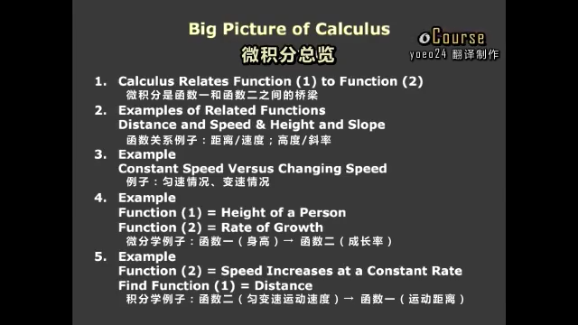

这节课是为了引出微积分概念的。  
## 0.先上本节课目录：  

  
## 1.微积分是函数一和函数二之间的桥梁
  
## 2.两个例子，函数一：距离和函数二：速度，函数一：高度和函数二：斜率 
.png)
  
## 3.例子：匀速情况、变速情况
从 $s$ 的匀速情况推出0起点的 $f$ ，再到非0起点的 $f$ ，最后画出变速的情况。  
函数二：$speed\ or\ slope=\frac{up}{across}=\frac{\Delta f}{\Delta t}=s$。  
函数一：$distance\ or\ height=f=st$。  
.png)  
.png)  
  
## 4.函数一：身高和函数二：成长率
.png)
  
## 5.均加速例子
函数一：$f=\frac{1}{2}at^2$。  
函数二：$s=at$。  
图像二下的面积就是函数一（函数二积分得到函数一）$area=\frac{1}{2}t(at)$；图像一求斜率得到函数二（函数一微分得到函数二）$\frac{df}{dt}=at$。  
.png)