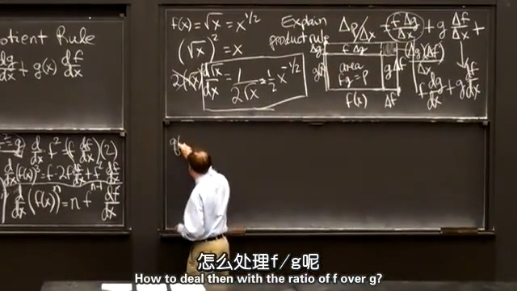

## 1.乘法法则
先放结论：
$$
P(x)=f(x)g(x) \\[2ex]
\frac{\operatorname{d}p}{\operatorname{d}x}=\frac{\operatorname{d}f}{\operatorname{d}x}g(x)+f(x)\frac{\operatorname{d}g}{\operatorname{d}x}
$$
  
## 2.乘法法则的应用（推导 $\frac{\operatorname{d}}{\operatorname{d}x}x^n$ 正数部分）
$$
\begin{array}{l}
    当f=x，g=x时： \\[2ex]
    \quad\frac{\operatorname{d}}{\operatorname{d}x}x^2=2x \\[2ex]
    当f=x^2，g=x时： \\[2ex]
    \quad\frac{\operatorname{d}}{\operatorname{d}x}x^3=2x\cdot x+x^2\cdot1=3x^2 \\[2ex]
    当f=x^3，g=x时： \\[2ex]
    \quad\frac{\operatorname{d}}{\operatorname{d}x}x^4=3x^2\cdot x+x^3\cdot1=4x^3 \\[2ex]
    \cdots \\[2ex]
    由数学归纳法得出： \\[2ex]
    \frac{\operatorname{d}}{\operatorname{d}x}x^n=nx^{n-1}(n=0,1,2,3\ldots) \\[2ex]
\end{array}
$$
  
上面是n为自然数的情况，下面将推广到正数，在推广到正数前，先证明下求导幂函数：
$$
\begin{array}{l}
    \frac{\operatorname{d}}{\operatorname{d}x}f^2=\frac{\operatorname{d}f}{\operatorname{d}x}\cdot f+f\cdot\frac{\operatorname{d}f}{\operatorname{d}x}=2f\frac{\operatorname{d}f}{\operatorname{d}x} \\[2ex]
    \frac{\operatorname{d}}{\operatorname{d}x}f^3=2f\frac{\operatorname{d}f}{\operatorname{d}x}\cdot f+f^2\cdot\frac{\operatorname{d}f}{\operatorname{d}x}=3f^2\frac{\operatorname{d}f}{\operatorname{d}x} \\[2ex]
    \frac{\operatorname{d}}{\operatorname{d}x}f^4=3f^2\frac{\operatorname{d}f}{\operatorname{d}x}\cdot f+f^3\cdot\frac{\operatorname{d}f}{\operatorname{d}x}=4f^3\frac{\operatorname{d}f}{\operatorname{d}x} \\[2ex]
    \cdots \\[2ex]
    由数学归纳法得出： \\[2ex]
    \frac{\operatorname{d}}{\operatorname{d}x}f^n=nf^{n-1}\frac{\operatorname{d}f}{\operatorname{d}x}(n=0,1,2,3\ldots) \\[2ex]
\end{array}
$$
  
这里求导幂函数的过程中其实还包含了链式法则，下节课会说明，下面就将幂法则推广到正数范围：  
$$
f(x)=\sqrt{x}=x^{\frac{1}{2}} \\[2ex]
\frac{\operatorname{d}}{\operatorname{d}x}f^2=2\sqrt{x}\frac{\operatorname{d}\sqrt{x}}{\operatorname{d}x}=1 \\[2ex]
\frac{\operatorname{d}f}{\operatorname{d}\sqrt{x}}=\frac{1}{2}x^{-\frac{1}{2}} \\[2ex]
$$

  
## 3.推导乘法法则
如下图所示
$$
\begin{aligned}
    \lim_{\Delta x \to 0}\frac{\Delta p}{\Delta x}&=\frac{f\cdot\Delta g}{\Delta x}+\frac{g\cdot\Delta f}{\Delta x}+\frac{\Delta g\cdot\Delta x}{\Delta x} \\
    &=f\frac{\operatorname{d}g}{\operatorname{d}x}+g\frac{\operatorname{d}f}{\operatorname{d}x}+0 \\
    &=f\frac{\operatorname{d}g}{\operatorname{d}x}+g\frac{\operatorname{d}f}{\operatorname{d}x}
\end{aligned}
$$

  
## 4.推导除法法则
$$
\begin{aligned}
  q(x)&=\frac{f(x)}{g(x)}\rightarrow f(x)=g(x)q(x)  \\[2ex]
  \frac{\operatorname{d}f}{\operatorname{d}x}&=\frac{\operatorname{d}g}{\operatorname{d}x}q(x)+g(x)\frac{\operatorname{d}q}{\operatorname{d}x} \\[2ex]
  \frac{\operatorname{d}f}{\operatorname{d}x}&=\frac{\operatorname{d}g}{\operatorname{d}x}\cdot\frac{f(x)}{g(x)}+g(x)\frac{\operatorname{d}q}{\operatorname{d}x} \\[2ex]
  \frac{\operatorname{d}q}{\operatorname{d}x}&=\frac{\operatorname{d}f}{\operatorname{d}x}\cdot\frac{1}{g(x)}-\frac{\operatorname{d}g}{\operatorname{d}x}\cdot\frac{f(x)}{g^2(x)} \\[2ex]
  &=\frac{\frac{\operatorname{d}f}{\operatorname{d}x}\cdot g(x)-f(x)\cdot\frac{\operatorname{d}g}{\operatorname{d}x}}{g^2(x)}
\end{aligned}
$$

  
## 5.除法法则的应用（推导 $\frac{\operatorname{d}}{\operatorname{d}x}x^n$ 负数部分）
$$
q(x)=\frac{f(x)}{g(x)}=\frac{1}{x^N}=x^{-N} \\[2ex]
\begin{aligned}
    \frac{\operatorname{d}}{\operatorname{d}x}(x^{-N})&=\frac{0-1\cdot Nx^{N-1}}{(x^N)^2} \\[2ex]
    &=-Nx^{-N-1}
\end{aligned} \\
$$
  
最后，无理数也适用幂法则的，这里就不证明了，例如：  
$$
\frac{\operatorname{d}}{\operatorname{d}x}x^\pi=\pi x^{\pi-1}
$$
