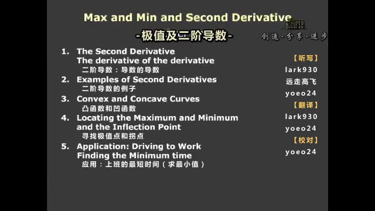
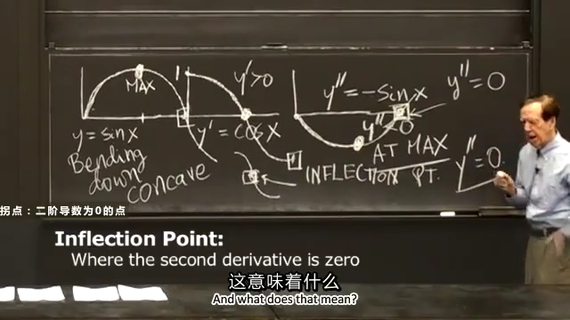
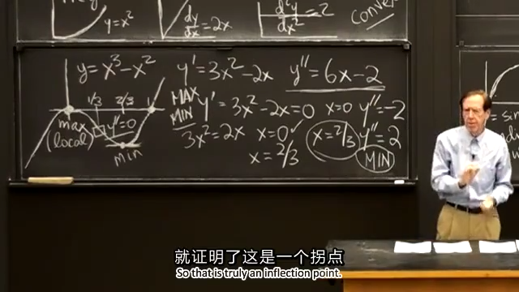
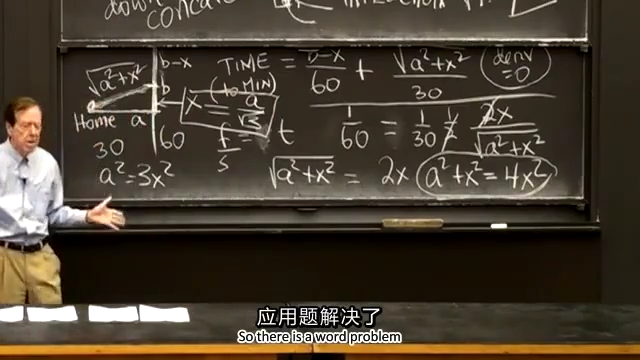

## 0.先上本节课目录：

  
## 1.二阶导数：导数的导数
我们经常需要定位极值点，并判别是极大值还是极小值。定位极值点是一阶导数的职责，一阶导数为0即为极值点；是极大值还是极小值这就是二阶导数的职责了，二阶导数的符号表示曲线的弯曲方向。
  
## 2.二阶导数的例子
这里用距离、速度（距离的导数）和加速度（速度的导数）来举例。
距离：
$$y=x^2$$
速度：
$$\frac{\operatorname dy}{\operatorname dx}=2x$$
加速度：
$$\frac{\operatorname d^2y}{\operatorname dx^2}=2$$
后面会讲到，这里的二阶导数永远大于0，图像为凸。  
.png)
  
## 3.凸函数和凹函数
按照国外教材定义，如果该处的二阶导数大于0，则这里的曲线向上弯曲（bending up），图像为凸（convex）；反之，二阶导数小于0，则这里的曲线向下弯曲（bending down），图像为凹（concave）。  
函数一：
$$y=\sin x$$
函数二：
$$\frac{\operatorname dy}{\operatorname dx}=\cos x$$
函数三：
$$\frac{\operatorname d^2y}{\operatorname dx^2}=-\sin x$$
观察下图中 $x=\pi/2$ （画圆点的部分）的位置， $y'=0$ ，$y$ 是极值位置， $y''<0$ ， $y$ 此时为凹，所以这里为极大值点；在 $x=\pi$ （画方框的部分），$y''=0$，这里为拐点，图像由凹变凸。  
总结下两个概念：
极值是一阶导数为0的点；
拐点（inflection point）是二阶导数为0的点，代表图形弯曲性的改变。  

  
## 4.寻找极值点和拐点
例子：寻找 $y=x^3-x^2$ 的极值点和拐点。（极值点和拐点只需求出令一阶导数和二阶导数为0的点，这里教授似乎是想画图）
先求一阶导数：
$$y'=3x^2-2x$$
令一阶导数等于0：
$$
y'=3x^2-2x=0 \\
x(3x-2)=0 \\
x_1=0\quad x_2=\frac{2}{3}
$$
求二阶导数：
$$y''=6x-2$$
将 $x_1=0\quad x_2=2/3$ 代入 $y''$ 得到：
$$
y''(0)=-2<0图像为凹 \\[2ex]
y''(\frac{2}{3})=2>0图像图凸
$$
令二阶导数等于0：
$$
y''=6x-2=0 \\
x=\frac{1}{3}
$$
得到拐点为 $x=1/3$ ，至此就可以画出 $y$ 的大致图像，与下图相符。

  
## 5.应用：上班的最短时间（求最小值）
例子：教授从家到MIT上课需要先开普通公路（30 mile/h）再开高速公路（60 mile/h），假设普通公路到高速公路是连续的，求何时上高速最快。
解：
$$
TIME=\frac{b-x}{60}+\frac{\sqrt{a^2+x^2}}{30} \\[2ex]
TIME'=-\frac{1}{60}+\frac{1}{2}\cdot\frac{1}{30\sqrt{a^2+x^2}}\cdot2x\quad(这里求导需要后面的知识：链式法则)
$$
令 $TIME'=0$，得到：
$$
TIME'=-\frac{1}{60}+\frac{1}{2}\cdot\frac{1}{30\sqrt{a^2+x^2}}\cdot2x\quad=0 \\
$$
$$
\begin{aligned}
\sqrt{a^2+x^2}&=2x \\
a^2+x^2&=4x^2 \\
x&=\frac{a}{\sqrt{3}}
\end{aligned}
$$
求二阶导：(链式法则和乘法法则)
$$
\begin{aligned}
TIME''&=1\cdot\frac{1}{30}(a^2+x^2)^{-\frac{1}{2}}+x\cdot\frac{1}{30}\cdot(-\frac{1}{2})(a^2+x^2)^{-\frac{2}{2}}\cdot2x \\[2ex]
&=\frac{1}{30\sqrt{a^2+x^2}}-\frac{x^2}{30(a^2+x^2)^\frac{3}{2}} \\
\end{aligned}
$$
$$
\begin{aligned}
TIME''(\frac{a}{\sqrt{3}})&=\frac{1}{30\cdot\frac{2a}{\sqrt{3}}}-\frac{\frac{a^2}{3}}{30(\frac{2a}{\sqrt{3}})^3} \\
&=\frac{1}{20\sqrt{3}a}-\frac{1}{30\cdot\frac{8a^3}{3\sqrt{3}}\cdot\frac{3}{a^2}} \\
&=\frac{1}{20\sqrt{3}a}-\frac{1}{80\sqrt{3}a} \\
&=\frac{3}{80\sqrt{3}a}>0
\end{aligned}
$$
此时图像为凸， $x=a/\sqrt{3}$ ，为极小值，又只有一个极值点，所以改点为最小值点。
