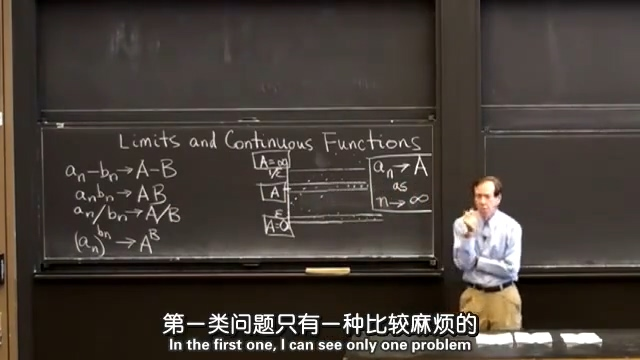
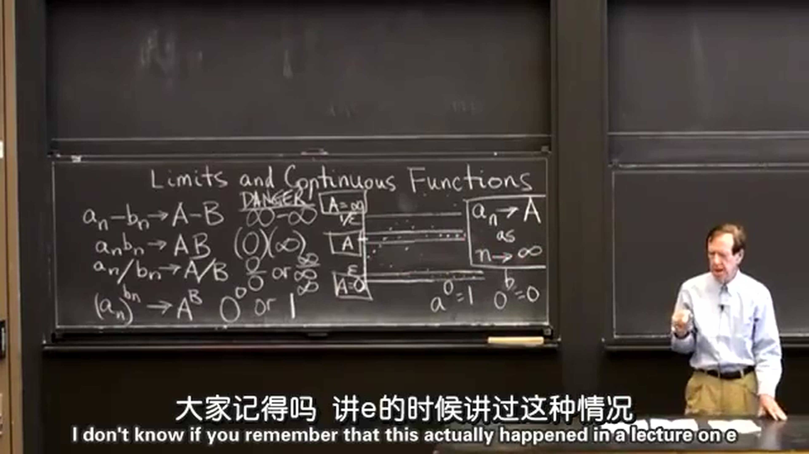
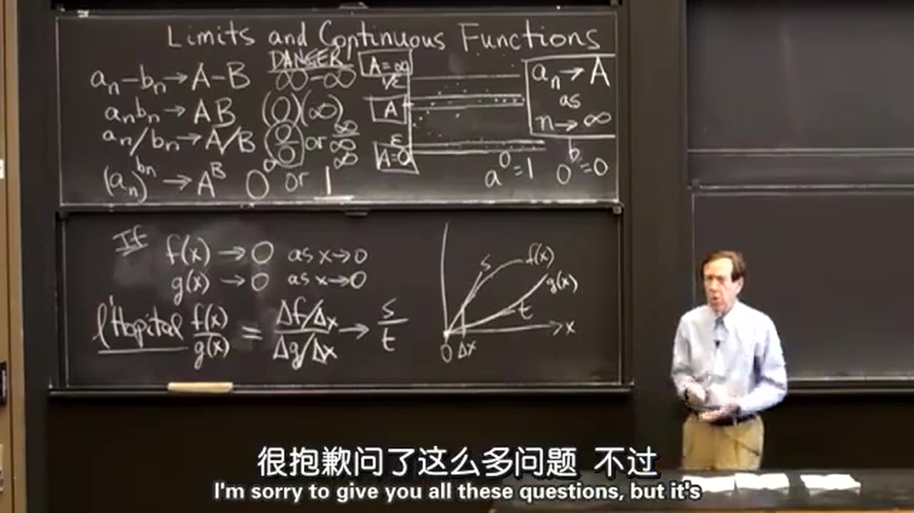

## 1.极限的一般情况
$\epsilon$ 在数学上往往用来表示极小的数，不管数列 $a_n$ 前面的数怎么变化，数列中足够靠后的数字无一例外的都会落在 $A-\epsilon$ 和 $A+\epsilon$ 之间，这就意味着当 $n$ 接近于 $\infty$ 时， $a_n$ 的值接近于 $A$ （用符号表示为：当 $n \rightarrow \infty$ 时， $a_n \rightarrow A$ ）。同样，落在 $0$ 和 $\epsilon$ 之间为趋向于 $0$ ；落在 $1/\epsilon$ 之上为无穷大极限。这里我们学习了三种极限，分别为零极限、正数极限和无穷大极限。当然也有一些是没有极限的，比如 $\sin x$ ，当 $x$ 趋于无穷大时是没有极限的。

  
## 2.极限的特殊情况
下面小标题的式子在一般情况下是成立的，现在列出特殊情况。  
  
### 2.1 $a_n-b_n \rightarrow A-B$
$\infty - \infty$
例：当 $a_n=n^2$ ， $b_n=n$ 时，$a_n-b_n \rightarrow \infty$ 。
例：当 $a_n=n$ ， $b_n=n$ 时，$a_n-b_n \rightarrow 0$ 。
从上述例子可以看出，当 $a_n \rightarrow \infty$ 和 $b_n \rightarrow \infty$ 时， $a_n-b_n$ 的结果可以是 $\infty$ ，也可以是 $-\infty$ ，还可以是任意数。
  
### 2.2 $a_nb_n \rightarrow AB$
$(0)(\infty)$
例：当 $a_n=1/n^2$ ， $b_n=n$ 时，$a_nb_n = 1/n\rightarrow 0$ 。
例：当 $a_n=1/n$ ， $b_n=n^2$ 时，$a_nb_n = n\rightarrow \infty$ 。
从上述例子可以看出，当 $a_n \rightarrow 0$ 和 $b_n \rightarrow \infty$ 时， $a_nb_n$ 的结果也可以是任意数。
  
### 2.3 $(a_n)^{b_n} \rightarrow A^B$
$0^0$ 或 $1^\infty$
例：当 $a_n=1+1/n$ ， $b_n = n$ 时， $(a_n)^{b_n} = (1+1/n)^n \rightarrow \rm e$ 。  
例：当 $a_n=1+1/n^2$ ， $b_n = n$ 时， $(a_n)^{b_n} = (1+1/n^2)^n \rightarrow \rm 1$ 。  
例：当 $a_n=1+1/n$ ， $b_n = n^2$ 时， $(a_n)^{b_n} = (1+1/n)^{n^2} \rightarrow \rm \infty$ 。

  
### 2.4 $a_n/b_n \rightarrow A/B$
$0/0$ （被教授称为微积分中最重要的问题之一）或 $\infty / \infty$  
洛必达法则  
$\frac{f(x)}{g(x)}=\frac{\Delta f}{\Delta g}=\frac{\Delta f/\Delta x}{\Delta g/\Delta x}\rightarrow\frac{s}{t}$

  
## 3.函数的连续性
接着提出了如果函数 $f(x)=\sqrt{x}$ 在0处无法使用洛必达法则，虽然其在0处是连续的，但是并不可导。  
.jpg)
然后给出了结论：可导必定连续，连续不一定可导。  
最后给出了函数连续性的定义：
对于任意的 $\epsilon > 0$ ，存在 $\delta > 0$ ，如果 $|x-a| < \delta$ ，那么 $|f(x)-f(a)| < \epsilon$ 。
.jpg)
例： $f(x)=\sin(\frac{1}{x})$ 就是一个不连续的例子，当 $x\rightarrow 0$ 时，函数值在-1与+1之间变动无限多次，所以点 $x=0$ 称为函数 $\sin(\frac{1}{x})$ 的振荡间断点。  
公式图.png)
例： $f(x)=x\sin(\frac{1}{x})$ 是一个连续的例子。  
公式图.png)