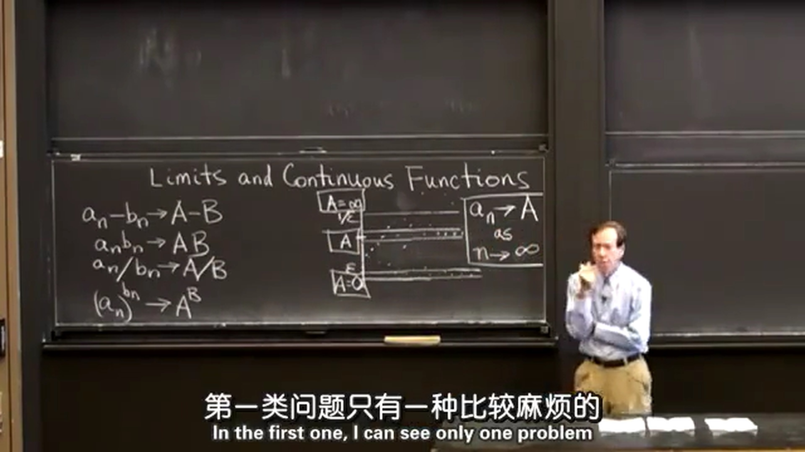

## 1.极限
$\epsilon$ 在数学上往往用来表示极小的数，不管数列 $a_n$ 前面的数怎么变化，数列中足够靠后的数字无一例外的都会落在 $A-\epsilon$ 和 $A+\epsilon$ 之间，这就意味着当 $n$ 接近于 $\infty$ 时， $a_n$ 的值接近于 $A$ （用符号表示为：当 $n \rightarrow \infty$ 时， $a_n \rightarrow A$ ）。同样，落在 $0$ 和 $\epsilon$ 之间为趋向于 $0$ ；落在 $1/\epsilon$ 之上为无穷大极限。这里我们学习了三种极限，分别为零极限、正数极限和无穷大极限。当然也有一些是没有极限的，比如 $\sin x$ ，当 $x$ 趋于无穷大时是没有极限的。

  
## 2.极限的特殊情况  
### 2.1 $a_n-b_n \rightarrow A-B$
$\infty - \infty$  
例：当 $a_n=n^2$ ， $b_n=n$ 时，$a_n-b_n \rightarrow \infty$ 。
例：当 $a_n=n$ ， $b_n=n$ 时，$a_n-b_n \rightarrow 0$ 。
从上述例子可以看出，当 $a_n \rightarrow \infty$ 和 $b_n \rightarrow \infty$ 时， $a_n-b_n$ 的结果可以是 $\infty$ ，也可以是 $-\infty$ ，还可以是任意数。
  
### 2.2 $a_nb_n \rightarrow AB$
$(0)(\infty)$  
例：当 $a_n=1/n^2$ ， $b_n=n$ 时，$a_nb_n = 1/n\rightarrow 0$ 。
例：当 $a_n=1/n$ ， $b_n=n^2$ 时，$a_nb_n = n\rightarrow \infty$ 。
从上述例子可以看出，当 $a_n \rightarrow 0$ 和 $b_n \rightarrow \infty$ 时， $a_nb_n$ 的结果也可以是任意数。
  
### 2.3 $(a_n)^{b_n} \rightarrow A^B$
$0^0$ 或 $1^\infty$  
例：当 $a_n=1+1/n$ ， $b_n = n$ 时， $(a_n)^{b_n} = (1+1/n)^n \rightarrow \rm e$ 。  
例：当 $a_n=1+1/n^2$ ， $b_n = n$ 时， $(a_n)^{b_n} = (1+1/n^2)^n \rightarrow \rm 1$ 。  
例：当 $a_n=1+1/n$ ， $b_n = n^2$ 时， $(a_n)^{b_n} = (1+1/n)^{n^2} \rightarrow \rm \infty$ 。

  
### 2.4 $a_n/b_n \rightarrow A/B$
$0/0$ （被教授称为微积分中最重要的问题之一）或 $\infty / \infty$  
洛必达法则  
$$
\frac{f(x)}{g(x)}=\lim_{\Delta x \to 0}\frac{f(x + \Delta x)}{g(x + \Delta x)}\overset{\text{当x=0时}}{=}\lim_{\Delta x \to 0}\frac{f(\Delta x)}{g(\Delta x)}=\lim_{\Delta x \to 0}\frac{f(\Delta x)/\Delta x}{g(\Delta x)/\Delta x}=\frac{f'(x)}{g'(x)}
$$

*教授应该是上式这个意思，但是这个证明的例子比较特殊，刚好是 $x\rightarrow 0时，f(x)\rightarrow 0，g(x)\rightarrow 0$ ;其实不管 $x$ 趋向于多少，只要 $f(x)$ 和 $g(x)$ 的极限等于0，上式也是成立的。*  
先列出导数的表达式：
$$
f'(x)=\lim_{\Delta x \to 0}\frac{f(x + \Delta x) - f(x)}{\Delta x}
$$
当 $f(x)$ 和 $g(x)$ 的极限等于0时：
$$
\frac{f(x)}{g(x)}=\lim_{\Delta x \to 0}\frac{f(x + \Delta x)}{g(x + \Delta x)}=\lim_{\Delta x \to 0}\frac{f(x + \Delta x)/\Delta x}{g(x + \Delta x)/\Delta x}=\frac{f'(x)}{g'(x)}
$$
*上面只证明了 $0/0$ ，并没有证明 $\infty / \infty$ ，其实两者都可以用洛必达法则。*
  
## 3.函数的连续性
接着提出了如果函数 $f(x)=\sqrt{x}$ 在0处无法使用洛必达法则，虽然其在0处是连续的，但是并不可导。  
.jpg)  
然后给出了结论：可导必定连续，连续不一定可导。  
最后给出了函数连续性的定义：  
对于任意的 $\epsilon > 0$ ，存在 $\delta > 0$ ，如果 $|x-a| < \delta$ ，那么 $|f(x)-f(a)| < \epsilon$ 。  
.jpg)  
例： $f(x)=\sin(\frac{1}{x})$ 就是一个不连续的例子，当 $x\rightarrow 0$ 时，函数值在-1与+1之间变动无限多次，所以点 $x=0$ 称为函数 $\sin(\frac{1}{x})$ 的振荡间断点。  
公式图.png)  
例： $f(x)=x\sin(\frac{1}{x})$ 是一个连续的例子。  
公式图.png)
  
## 4.洛必达法则
*感觉这节课讲的比较浅，我又看了《普林斯顿微积分读本》中的洛必达部分下面大概讲下思路。*  
我们学过的大部分极限都是以下情况之一：  
$$
\lim_{x \to a}\frac{f(x)}{g(x)}，\lim_{x \to a}(f(x)-g(x))，\lim_{x \to a}f(x)g(x)，\lim_{x \to a}{f(x)}^{g(x)}
$$
有时你可以利用函数的连续性直接用 $a$ 来替代 $x$ 进行计算，但这种方法可能解决不了问题。例如，本节课第二节的特殊情况。  
第一种类型是两个函数的比 $f(x)/g(x)$ ，最适合用洛必达法则，我们称它为“类型A”。接下来两种类型为 $f(x)-g(x)$ 和 $f(x)g(x)$ ，都可以转化为“类型A”，所以我们管他们叫“类型B1”和“类型B2”。最后我们把关于指数型函数 ${f(x)}^{g(x)}$ 的类型叫做“类型C”，该类型可以转化为“类型B2”，从而再转化为“类型A”。  
  
### 4.1 类型A： $0/0$ 和 $\pm\infty / \pm\infty$
例：  
$$
\lim_{x \to 3}\frac{x^2-9}{x-3}\overset{\text{l'H}}{=}\frac{2x}{1}=6
$$
这道题也可以用因式分解解决：
$$
\lim_{x \to 3}\frac{x^2-9}{x-3}=\lim_{x \to 3}\frac{(x+3)(x-3)}{x-3}=\lim_{x \to 3}(x+3)=3+3=6
$$
两个方法得到的答案相同。
  
### 4.2 类型B1：( $\infty - \infty$ )
例：  
$$
\lim_{x \to 0}(\frac{1}{\sin x} - \frac{1}{x})=\lim_{x \to 0}\frac{x-\sin x}{x\sin x}\overset{\text{l'H}}{=}\lim_{x \to 0}\frac{1-\cos x}{\sin x+x\cos x}\overset{\text{l'H}}{=}\lim_{x \to 0}\frac{\sin x}{2\cos x-x\sin x}=\frac{0}{2+0}=0
$$
  
### 4.3 类型B2：( $0\times\pm\infty$ )
$$
\lim_{x \to 0^+}x\ln x=\lim_{x \to 0^+}\frac{\ln x}{1/x}\overset{\text{l'H}}{=}\lim_{x \to 0^+}\frac{1/x}{-x^{-2}}=\lim_{x \to 0^+}(-x)=0
$$
  
### 4.3 类型C： $1^{\pm \infty}$ ， $0^0$ 和 $\infty ^ 0$
例：
$$
\lim_{x \to 0^+}x^{\sin x}
$$
取对数：
$$
\lim_{x \to 0^+}\sin x\ln x=\lim_{x \to 0^+}\frac{\ln x}{1/\sin x}\overset{\text{l'H}}{=}\lim_{x \to 0^+}\frac{1/x}{-1/(\sin x)^{-2}\cos x}=\lim_{x \to 0^+}\frac{-(\sin x)^{2}}{x\cos x}=\lim_{x \to 0^+}-\frac{\sin x}{x}\frac{\sin x}{\cos x}=-1\times 0=0
$$
再求指数：
$$
\lim_{x \to 0^+}x^{\sin x}=\rm e^0=1
$$
这里是先求该函数的对数，再用处理“类型B2”的方法计算极限。最后，再对刚才的计算结果求指数。

*学完这课明显感觉自己的基础比较差，后面有空可以把书从头看一遍再找找有没有合适的练习，这里立个flag。*