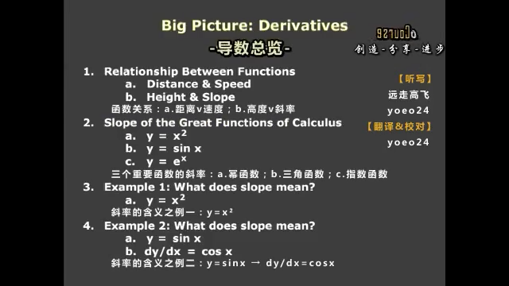
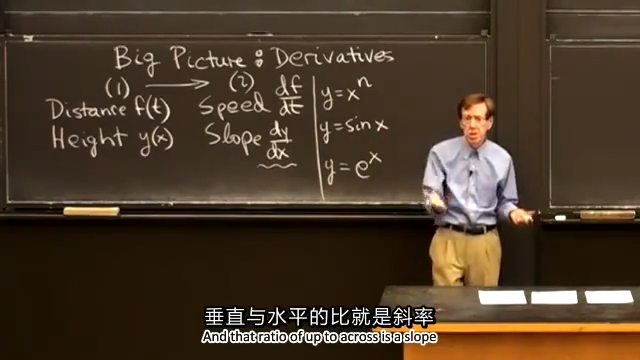
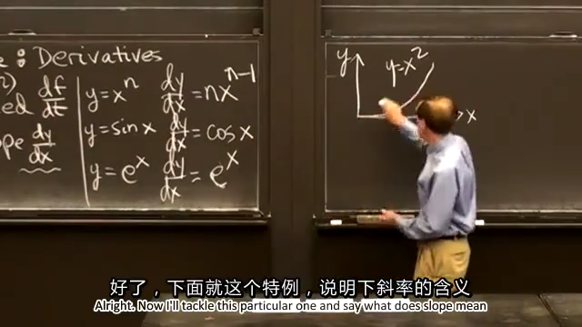

这节课是为了引出导数概念的。  
## 0.先上本节课目录：  
  
  
## 1.函数关系
从 a.距离v速度；b.高度v斜率 来引出斜率概念。
  
  
## 2.三个重要函数的斜率
这里先给出了幂函数、三角函数和指数函数的斜率（这里是瞬时斜率也就是导数，不是平均斜率）。
  
  
## 3.斜率的含义之例一：$y=x^2$
### 3.1 平均斜率
先求了 $x$ 在 $[1,2]$ 之间的平均斜率：  
$$average\ slope=\frac{\Delta y}{\Delta x}=\frac{y(2)-y(1)}{2-1}=\frac{2^2-1}{1}=3$$  
接着求 $x$ 在 $0$ 处的瞬时斜率：  
$$average\ slope=\frac{\Delta y}{\Delta x}=\frac{\Delta x^2-0}{\Delta x-0}=\Delta x$$  
$$constant \ slope=0$$
.png)  
### 3.2 瞬时斜率（导数）
下面来求任意点的斜率：  
取一个微小的量 $\Delta x$，有：  
$$\frac{\Delta y}{\Delta x}=\frac{y(x+\Delta x)-y(x)}{\Delta x}=\frac{(x+\Delta x^2)-x^2}{\Delta x}=\frac{x^2+2x\Delta x+\Delta x^2-x^2}{\Delta x}=2x+\Delta x$$  
$$\frac{\operatorname dy}{\operatorname dx}=\lim_{\Delta x \to 0}\frac{\Delta y}{\Delta x}=\lim_{\Delta x \to 0}(2x+\Delta x)=2x$$
.png)  
.png)  
上式中已经求出了瞬时斜率（导数）为 $2x$ ，为过原点的直线，代入 $x=0$ ，得到 $0$ ，与3.1中计算的瞬时斜率相符。同理，在 $x=1$ 处，瞬时斜率为 $2$ 。  
.png)  
  
## 4.斜率的含义之例二：$y=sinx$
$y=sinx$ 的瞬时斜率（导数）为： $cosx$ ，这里先有个印象，并未给出证明。
.png)  
