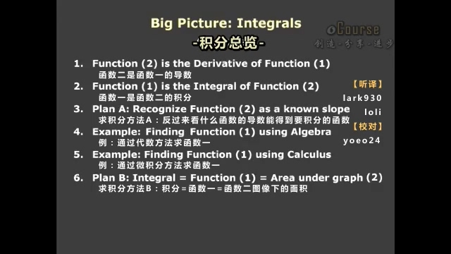
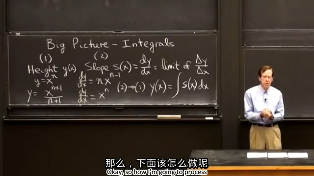
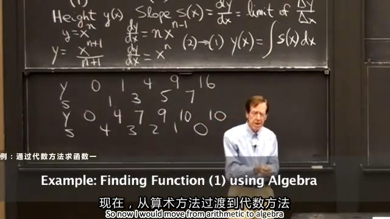
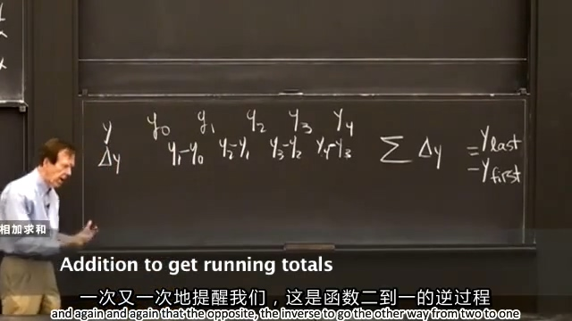
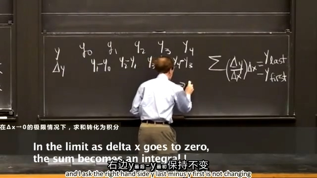
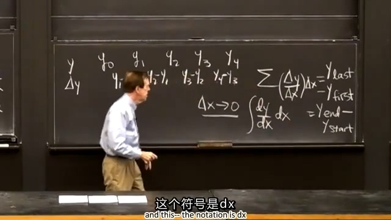
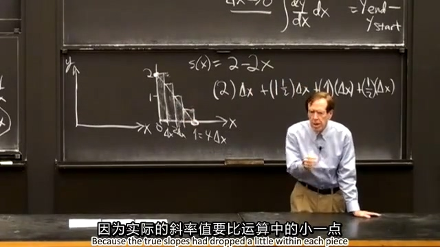
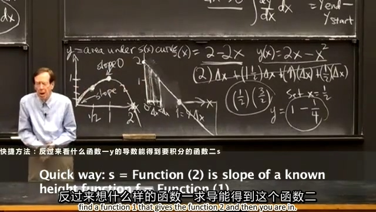

## 0.先上本节课目录：

  
## 1.函数二是函数一的导数
函数一： $Height y(x)$  
函数二： $Slope s(x)$
函数一 -> 函数二：
$$
Slope s(x)=\frac{\operatorname dy}{\operatorname dx}=limit\ of\ \frac{\Delta y}{\Delta x}
$$
这里复习了导数，如果函数一是直线，直接用 $\frac{\Delta y}{\Delta x}$就可以求出其导数，如果是曲线，就需要用极限求其导数。
  
## 2.函数一是函数二的积分
函数二 -> 函数一：
$$
y(x)=\int s(x)\operatorname dx
$$
这里介绍了积分符号。
  
## 3.求积分的方法A：反过来看什么函数的导数能得到积分的函数
大家都知道 $y=x^n$ 的导数是 $\frac{\operatorname dy}{\operatorname dx}=nx^{n-1}$ ，反过来 $\frac{\operatorname dy}{\operatorname dx}=nx^{n-1}$ 的积分是 $y=x^n$ 。  
那如果函数二是 $\frac{\operatorname dy}{\operatorname dx}=x^n$ ，反推函数一应该含有 $x^{n+1}$ ，这里 $x^{n+1}$ 求导后会有个系数 $n+1$ ，所以函数一要再除以  $n+1$ ，最终得到的积分是 $y=\frac{1}{n-1}x^{n+1}$ 。  
这里其实就是用公式法，后续学习更多常见函数的求导公式后可以反推更多的积分公式。

  
## 4.例：通过代数方法求函数一
要考虑连续情形下的积分，先考虑单独间隔下的情况，然后缩小间隔，最后取极限使其连续。  
先介绍单独间隔下的情况（算术方法），假设 $y$ 之间的间隔（ $\Delta x$ ）都是单位1，求 $s$ 就相当于求 $\Delta y$ ，有了 $s$ 后也可以反推 $y$ 。
$$
\begin{aligned}
    &y\quad0\quad1\quad4\quad9\quad16 \\
    \rightarrow\quad&s\quad\quad1\quad3\quad5\quad7
\end{aligned}
$$
下面如果我们知道 $s$ ，假设 $y$ 是从0开始，变可以推出 $y$ ，如下式所示。
$$
\begin{aligned}
    \rightarrow\quad&y\quad0\quad4\quad7\quad9\quad10\quad10 \\
    &s\quad\quad4\quad3\quad2\quad1\quad0
\end{aligned}
$$

  
这里我们引入字母（代数方法），假设 $y$ 之间的间隔（ $\Delta x$ ）还是是单位1，此时 $y$ 不是从0开始了，我们只能求 $y_{last}-y_{first}$ ，比如 $y_2-y_0=(y_1-y_0)+(y_2-y_1)$ 。
$$
\begin{aligned}
    &y\qquad y_0\qquad\quad y_1\qquad\quad y_2\qquad\quad y_3\qquad\quad y_4 \\
    &s(\Delta y)\quad y_1-y_0\quad y_2-y_1\quad y_3-y_2\quad y_4-y_3
\end{aligned}
$$
$$
\sum\Delta y=y_{last}-y_{first} \\
$$

  
然后，我们要缩小间隔（ $\Delta x$ ），此时 $s$ 就要变为 $\frac{\Delta y}{\Delta x}$ ，乘以 $\Delta x$ 后得到 $\Delta y$ ，累加又可以获到 $y_{last}-y_{first}$ 了。
$$
\sum\left(\frac{\Delta y}{\Delta x}\Delta x\right)=y_{last}-y_{first}
$$
当 $\Delta x$ 不断变小， $\frac{\Delta y}{\Delta x}$ 会不断接近 $\frac{\operatorname dy}{\operatorname dx}$ ，下面就要讲到极限的情况。

  
## 5.例：通过微积分方法求函数一
上式在 $\Delta x\rightarrow0$ 的情况下，求和转化为积分
$$
\int\left(\frac{\operatorname dy}{\operatorname dx}\operatorname dx\right)=y_{last}-y_{first}
$$

  
## 6.求积分方法B：积分=函数一=函数二下的面积
函数二： $s(x)=2-2x$ 
假设函数二是速度和时间的函数（这样更好理解），将时间四等分且假定速度在每个时间段（ $\Delta x$ ）中保持不变，如下图所示。下面将通过加法得到 $y$ 值，此时得到的值并不精确，后面将不断缩小 $\Delta x$ 以获取精确的 $y$ 值。  

  
当 $\Delta x \rightarrow0$ 时， $y$ 就成了曲线 $s(x)$ 下的面积， $y(1)$ 就是三角形的面积 $1$ ， $y(1/2)$ 就是梯形面积 $3/4$ ，用公式法得到 $y(x)=2x-x^2$ ，代入 $1$ 和 $1/2$ 结果与我们得到的面积相符。 $y(x)$ 图像如下图所示。  

  