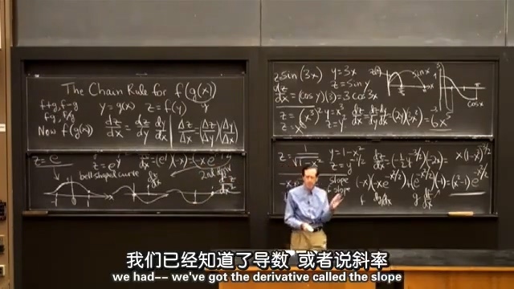

## 1.链式法则
照例先给出链式法则：
$$
y=g(x)\quad z=f(y) \\[2ex]
\frac{\operatorname{d}z}{\operatorname{d}x}=\frac{\operatorname{d}z}{\operatorname{d}y}\frac{\operatorname{d}y}{\operatorname{d}x} \\[2ex]
$$

  
## 2.例子： $sin(3x)$ 求导
$$
z=\sin(3x)  \\[2ex]
设y=3x，z=\sin y \\[2ex]
\frac{\operatorname{d}z}{\operatorname{d}x}=\frac{\operatorname{d}z}{\operatorname{d}y}\frac{\operatorname{d}y}{\operatorname{d}x}=\cos y\cdot3=3\cos(3x) \\[2ex]
$$
求导.jpg)
  
## 3.例子： $(x^3)^2$ 求导
$$
z=(x^3)^2 \\[2ex]
设y=x^3 ，z=y^2 \\[2ex]
\frac{\operatorname{d}z}{\operatorname{d}x}=\frac{\operatorname{d}z}{\operatorname{d}y}\frac{\operatorname{d}y}{\operatorname{d}x}=(2y)(3x^2)=6x^5 \\[2ex]
直接求导z=x^6，也可以得到结果为：6x^5
$$
  
## 4.例子： $\frac{1}{\sqrt{1-x^2}}$ 求导
$$
z=\frac{1}{\sqrt{1-x^2}} \\[2ex]
设y=1-x^2 ，z=\frac{1}{\sqrt{y}} \\[2ex]
\frac{\operatorname{d}z}{\operatorname{d}x}=\frac{\operatorname{d}z}{\operatorname{d}y}\frac{\operatorname{d}y}{\operatorname{d}x}=-\frac{1}{2}y^{-\frac{3}{2}}(-2x)=x(1-x^2)^{-\frac{3}{2}}
$$

  
## 5.推导链式法则
$$
\lim_{\Delta x \to 0}\frac{\Delta z}{\Delta x}=\lim_{\Delta x \to 0}\left(\frac{\Delta z}{\Delta y}\frac{\Delta y}{\Delta x}\right)=\frac{\operatorname{d}z}{\operatorname{d}y}\frac{\operatorname{d}y}{\operatorname{d}x}
$$

  
## 6.例子： ${\rm e}^{-\frac{x^2}{2}}$ 求一次导数和二次导数
$$
z={\rm e}^{-\frac{x^2}{2}} \\[2ex]
设y=-\frac{x^2}{2} ，z={\rm e}^y 则： \\[2ex]
\frac{\operatorname{d}z}{\operatorname{d}x}=\frac{\operatorname{d}z}{\operatorname{d}y}\frac{\operatorname{d}y}{\operatorname{d}x}={\rm e}^y\cdot(-x)=-xe^{-\frac{x^2}{2}} \\[2ex]
\begin{aligned}
\frac{\operatorname{d^2}z}{\operatorname{d}x^2}&=-{\rm e}^{-\frac{x^2}{2}}+(-x){\rm e}^{-\frac{x^2}{2}}(-x) \\[2ex]
&=-{\rm e}^{-\frac{x^2}{2}}+x^2{\rm e}^{-\frac{x^2}{2}} \\[2ex]
&=(x^2-1){\rm e}^{-\frac{x^2}{2}} \\[2ex]
\end{aligned}
$$
钟形曲线（正态分布曲线）

链式法则的二次导数大家可以自行学习。