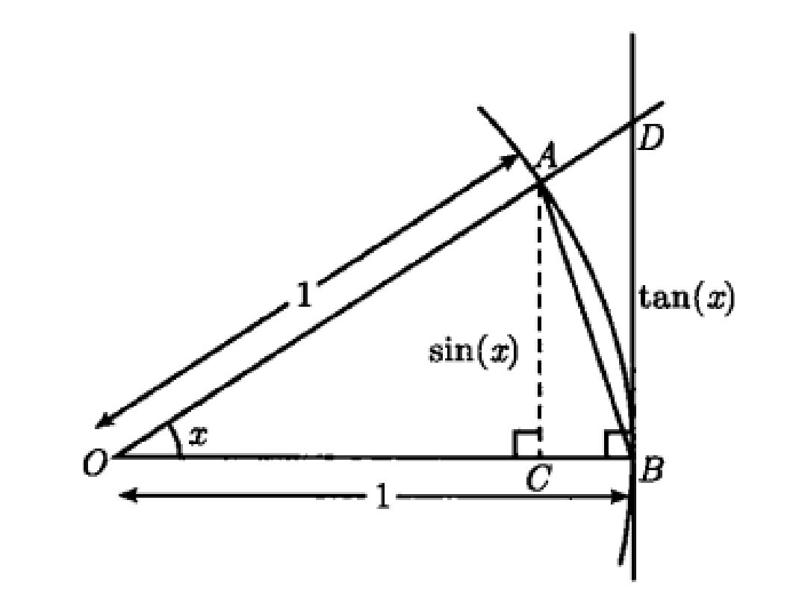

*这节课先看了教授的视频没看懂，后来又去看了《普林斯顿微积分读本》看懂了，再看教授的课程才明白，这里就按照我的理解讲下《普林斯顿微积分读本》里的证明过程。*  
  
## 1.求 $\sin x$ 的导数
令 $f(x)=\sin x$ ，则：
$$
\begin{aligned}
f'(x)&=\lim_{\Delta x \to 0}\frac{f(x+\Delta x)-f(x)}{\Delta x} \\[2ex]
&=\lim_{\Delta x \to 0}\frac{\sin(x+\Delta x)-\sin x}{\Delta x} \\[2ex]
&=\lim_{\Delta x \to 0}\frac{\sin x\cos\Delta x+\cos x\sin \Delta x-\sin x}{\Delta x} \\[2ex]
&=\lim_{\Delta x \to 0}\frac{\sin x(\cos\Delta x-1)+\cos x\sin \Delta x}{\Delta x} \\[2ex]
&=\lim_{\Delta x \to 0}\left[\sin x\frac{(\cos\Delta x-1)}{\Delta x}+\cos x\frac{\sin \Delta x}{\Delta x}\right] \\[2ex]
&=\sin x\lim_{\Delta x \to 0}\frac{(\cos\Delta x-1)}{\Delta x}+\cos x\lim_{\Delta x \to 0}\frac{\sin \Delta x}{\Delta x}
\end{aligned}
$$
到这里就计算不下去了，我们需知道当 $\Delta x$ 趋于0时， $\frac{(\cos\Delta x-1)}{\Delta x}$ 的极限和 $\frac{\sin \Delta x}{\Delta x}$ 的极限。
  
## 2. 求 $\frac{\sin x}{x}$ 在0处的极限
如下图所示， $OA=1$ ，$\angle AOB=x$ ， 则 $|AC|=\sin x$ ， $|DB|=\tan x$ 。  

$$
\because S_{\triangle OAB}<S_{扇形 OAB}<S_{\triangle ODB} \\[2ex]
\therefore\frac{\sin x}{2}<\frac{x}{2}<\frac{\tan x}{2} \\[2ex]
\therefore\sin x<x<\tan x 
\quad x\in[0,\frac{\pi}{2}] \\[2ex]
\therefore\frac{1}{\sin x}>\frac{1}{x}>\frac{1}{\tan x}\quad x\in[0,\frac{\pi}{2}] \\[2ex]
\therefore1>\frac{\sin x}{x}>\cos x\quad x\in[0,\frac{\pi}{2}] \\[2ex]
\therefore\cos x<\frac{\sin x}{x}<1\quad x\in[0,\frac{\pi}{2}] \\[2ex]
\lim_{x \to 0}\cos x=1,\lim_{x \to 0}1=1
$$
根据三明治定理（夹逼定理），得到：
$$
\lim_{x \to 0}\frac{\sin x}{x}=1
$$
这里，教授是分别证明 $\sin x<x$ 和 $\tan x > x$ ，最后也是使用夹逼定理得证。
  
## 3. 求 $\frac{(\cos x-1)}{x}$ 在0处的极限
$$
\begin{aligned}
    \lim_{x \to 0}\frac{\cos x-1}{x}&=\lim_{x \to 0}\frac{(\cos x-1)(\cos x+1)}{x(\cos x+1)} \\[2ex]
    &=\lim_{x \to 0}\frac{\cos^2x-1}{x(\cos x+1)} \\[2ex]
    &=\lim_{x \to 0}\frac{1-\sin^2x-1}{x(\cos x+1)} \\[2ex]
    &=\lim_{x \to 0}\frac{-\sin^2x}{x(\cos x+1)} \\[2ex]
    &=\lim_{x \to 0}[-\sin x\cdot\frac{\sin x}{x}\cdot\frac{1}{(\cos x+1)}] \\[2ex]
    &=-0\cdot1\cdot\frac{1}{1+1} \\[2ex]
    &=0
\end{aligned}
$$
这里，教授用了“捷径”，求 $\frac{(\cos x-1)}{x}$ 在0处的极限，就是求 $\cos x$ 在0处的导数，由图像可知，此处为极大值点，其导数为0。
  
## 4.再求 $\sin x$ 的导数
我们已经知道当 $\Delta x$ 趋于0时， $\frac{(\cos\Delta x-1)}{\Delta x}$ 的极限为0和 $\frac{\sin \Delta x}{\Delta x}$ 的极限为1，继续1小节中的求导：
$$
\begin{aligned}
f'(x)&=\sin x\lim_{\Delta x \to 0}\frac{(\cos\Delta x-1)}{\Delta x}+\cos x\lim_{\Delta x \to 0}\frac{\sin \Delta x}{\Delta x} \\[2ex]
&=\sin x\cdot0+\cos x\cdot1 \\
&=\cos x
\end{aligned}
$$
这里已经得到 $\sin x$ 的导数为 $\cos x$ 。

## 5.求 $\cos x$ 的导数
同样，令 $f(x)=\cos x$ ，则：
$$
\begin{aligned}
f'(x)&=\lim_{\Delta x \to 0}\frac{f(x+\Delta x)-f(x)}{\Delta x} \\[2ex]
&=\lim_{\Delta x \to 0}\frac{\cos(x+\Delta x)-\cos x}{\Delta x} \\[2ex]
&=\lim_{\Delta x \to 0}\frac{\cos x\cos\Delta x-\sin x\sin \Delta x-\cos x}{\Delta x} \\[2ex]
&=\lim_{\Delta x \to 0}\frac{\cos x(\cos\Delta x-1)-\sin x\sin \Delta x}{\Delta x} \\[2ex]
&=\lim_{\Delta x \to 0}\left[\cos x\frac{(\cos\Delta x-1)}{\Delta x}-\sin x\frac{\sin \Delta x}{\Delta x}\right] \\[2ex]
&=\cos x\lim_{\Delta x \to 0}\frac{(\cos\Delta x-1)}{\Delta x}-\sin x\lim_{\Delta x \to 0}\frac{\sin \Delta x}{\Delta x} \\[2ex]
&=\cos x\cdot0-\sin x\cdot1 \\
&=-\sin x
\end{aligned}
$$