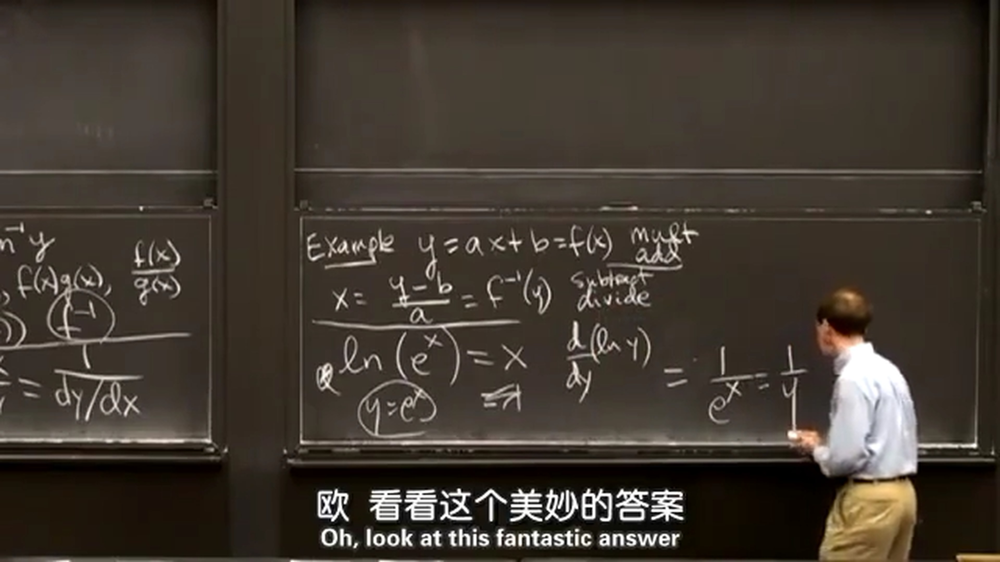
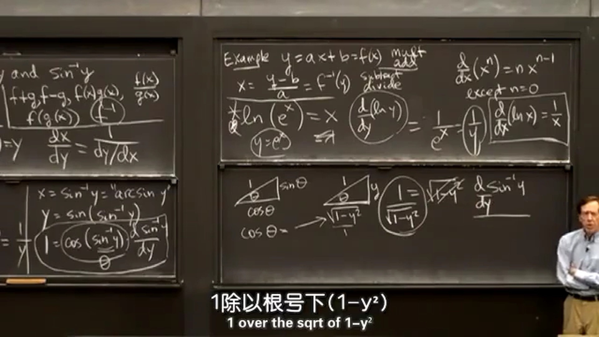
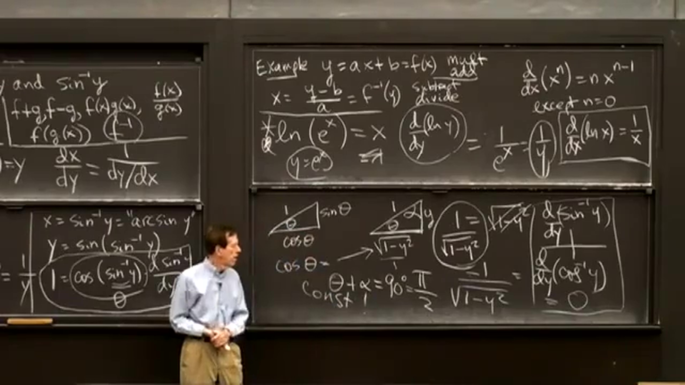

## 1.对数函数的导数
首先回顾了之前学过的求导法则：加减、乘除和链式法则。下面的求导将用到链式求导法则和逆函数。  
根据逆函数可以得到： $f^{-1}(f(x))=x$ 和 $f(f^{-1}(y))=y$ 。对其进行链式法则求导就可以得到逆函数的导数。  

  
复习下逆函数：  
例： $y=ax+b=f(x)$ 。求得逆函数为： $x=\frac{y-b}{a}=f^{-1}(y)$ 。
可以看到原函数 $f(x)$ 为**先乘再加**；逆函数 $f^{-1}(y)$ 为**先减再除**。  
  
下面正式开始求对数函数的导数：  
使用 $y=e^x=f(x)$ 构造前面所说的函数： $f^{-1}(f(x))=\ln(e^x)=x$ ，接着对两边同时求导：
$$
\begin{aligned}
&\frac{\operatorname d}{\operatorname d x}(\ln(e^x))=\frac{\operatorname d}{\operatorname d x}(x) \\[2ex]
&\frac{\operatorname d}{\operatorname d y}(\ln y)\frac{\operatorname d}{\operatorname d x}(e^x)=1 \\[2ex]
&\frac{\operatorname d}{\operatorname d y}(\ln y)e^x=1 \\[2ex]
&\frac{\operatorname d}{\operatorname d y}(\ln y)=\frac{1}{e^x} \\[2ex]
&\frac{\operatorname d}{\operatorname d y}(\ln y)=\frac{1}{y} \\[2ex]
\end{aligned}
$$
  
求导时，没有幂函数可以得到 $-1$ 次方（幂函数的 $n=0$ 时，右侧等于 $0$ ，得不到 $-1$ 次方）。这就像导数列表中的一个遗漏，现在终于补充完整了。观察对数函数及其导数发现，对数曲线时在增长，但是其斜率在减小，当 $x$ 很大时，它几乎不怎么增长了。  
  
使用 $x=\ln y=f^{-1}(y)$ 构造前面所说的另一函数： $f(f^{-1}(y))=e^{\ln y}=y$ ，接着对两边同时求导：  
$$
\begin{aligned}
&\frac{\operatorname d}{\operatorname d y}(e^{\ln y})=\frac{\operatorname d}{\operatorname d y}(y) \\[2ex]
&e^{\ln y}\frac{\operatorname d}{\operatorname d y}({\ln y})=1 \\[2ex]
&y\frac{\operatorname d}{\operatorname d y}({\ln y})=1 \\[2ex]
&\frac{\operatorname d}{\operatorname d y}({\ln y})=\frac{1}{y} \\[2ex]
\end{aligned}
$$
与之前求的结果相同。  
  
## 2.反三角函数的导数
## 2.1 $\sin^{-1}y$ 的导数
同样，使用 $x=\sin^{-1}y$ 构造函数： $y=\sin(\sin^{-1}y)$ ，接着对两边同时求导：  
$$
\begin{aligned}
&1=\cos(\sin^{-1}y)\frac{\operatorname d}{\operatorname d y}(\sin^{-1}y) \\[2ex]
&1=\sqrt{1-y^2}\frac{\operatorname d}{\operatorname d y}(\sin^{-1}y) \\[2ex]
&\frac{\operatorname d}{\operatorname d y}(\sin^{-1}y)=\frac{1}{\sqrt{1-y^2}} \\[2ex]
\end{aligned}
$$
$\cos(\sin^{-1}y)$ 为什么等于 $\sqrt{1-y^2}$ 下图有解释：  
  
  
## 2.2 $\cos^{-1}y$ 的导数
使用 $x=\cos^{-1}y$ 构造函数： $y=\cos(\cos^{-1}y)$ ，接着对两边同时求导：  
$$
\begin{aligned}
&1=-\sin(\cos^{-1}y)\frac{\operatorname d}{\operatorname d y}(\cos^{-1}y) \\[2ex]
&1=-\sqrt{1-y^2}\frac{\operatorname d}{\operatorname d y}(\cos^{-1}y) \\[2ex]
&\frac{\operatorname d}{\operatorname d y}(\cos^{-1}y)=-\frac{1}{\sqrt{1-y^2}} \\[2ex]
\end{aligned}
$$
  
根据前面求得的反三角函数的导数，我们知道函数 $y=\sin^{-1}x + \cos^{-1}x$ ，其导数为 $0$ ，说明函数 $y$ 为常函数。如下图所示， $y=\sin^{-1}x + \cos^{-1}x=\theta + \alpha=90\degree=\pi/2$ 。  
