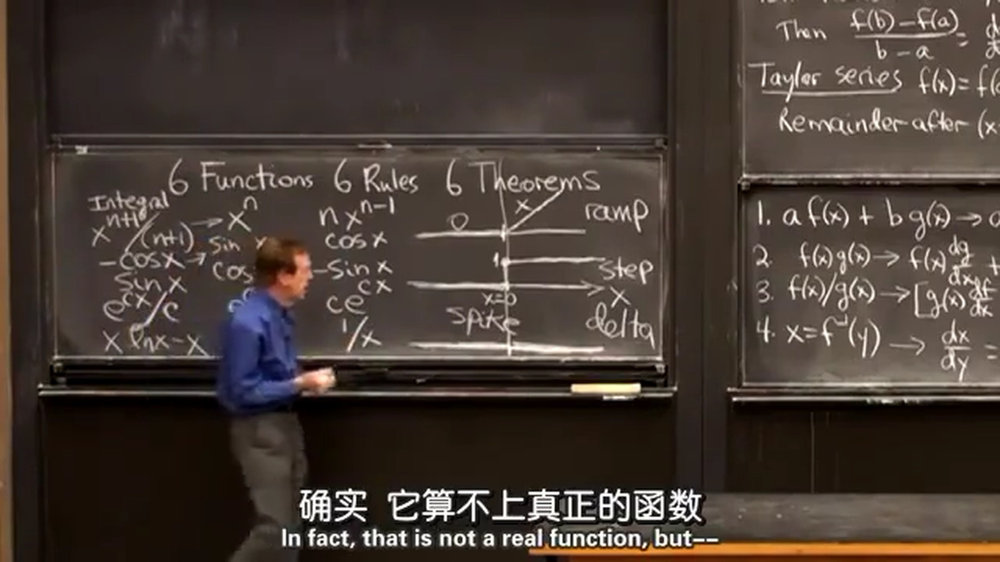
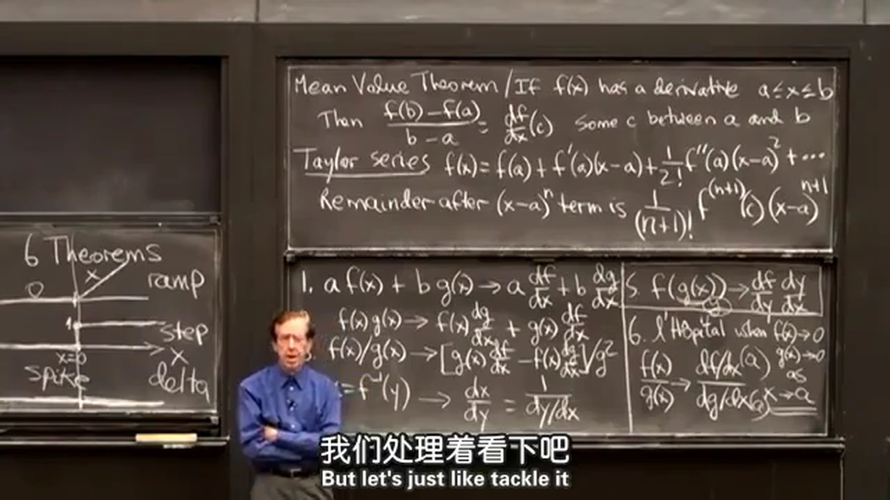
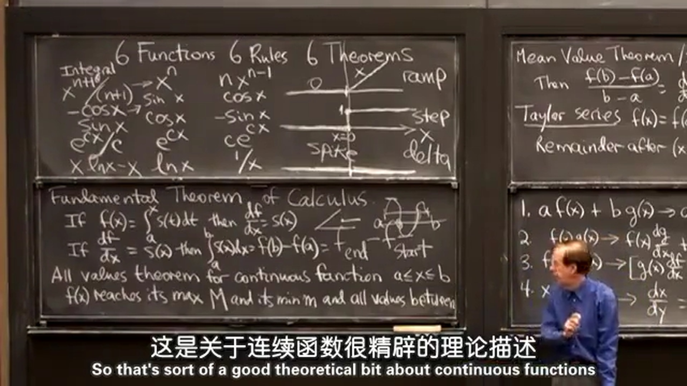
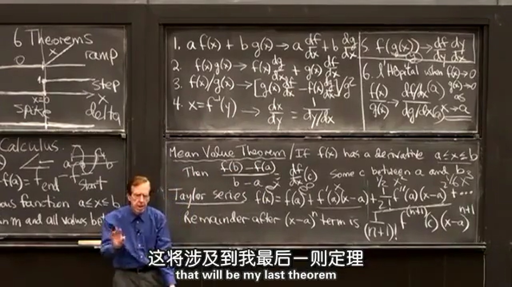
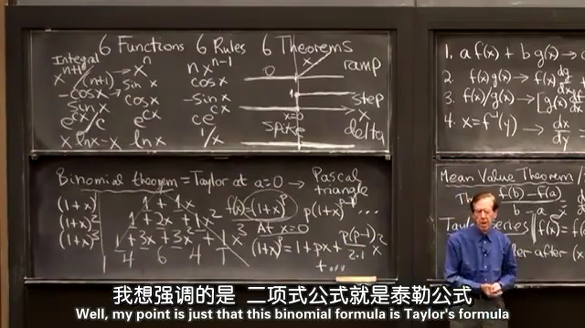

## 1.六函数
| 积分 | 六函数 | 导数 |
|------|-------|------|
| $x^{n+1}/(n+1)$ | $x^n$ | $nx^{n-1}$ |
| $-\cos x$ | $\sin x$ | $\cos x$ |
| $\sin x$ | $\cos x$ | $-\sin x$ |
| $\rm e^{cx}/c$ | $\rm e^{cx}$ | $c\rm e^{cx}$ |
| $x\ln x - x$ | $\ln x$ | $1/x$ |
| 斜坡函数 Ramp function | 阶跃函数 Step function | 冲激函数 Delta function |
$\ln x$ 的积分教授使用“易得法”得到，事实上使用分部积分法更清晰。  
阶跃函数是不连续函数，其积分为斜坡函数，导数为冲激函数（又名狄拉克 $\delta$ 函数）。冲激函数在其他处为 $0$ ，某一点突然变为无穷大，该点处的面积为 $1$ 。  

  
## 2.六法则
1. 加法法则： $af(x)+bg(x)$ 的导数为
$$
a\frac{\operatorname{d}f}{\operatorname{d}x} + b\frac{\operatorname{d}g}{\operatorname{d}x}
$$
  
2. 乘法法则： $f(x)g(x)$ 的导数为
$$
\frac{\operatorname{d}f}{\operatorname{d}x}g(x) + f(x)\frac{\operatorname{d}g}{\operatorname{d}x}
$$
  
3. 除法法则： $f(x)/g(x)$ 的导数为
$$
\left(\frac{\operatorname{d}f}{\operatorname{d}x}g - f\frac{\operatorname{d}g}{\operatorname{d}x}\right)/{g^2}
$$
  
4. 链式法则： $f(g(x)) \quad y=g(x)$ 的导数为
$$
\frac{\operatorname{d}f}{\operatorname{d}y}\frac{\operatorname{d}y}{\operatorname{d}x}
$$
  
5. 逆函数法则： $x=f^{-1}(y)$ 的导数为（逆函数的导数为原函数导数分之一）
$$
\frac{\operatorname{d}x}{\operatorname{d}y}=\frac{1}{\operatorname{d}y/\operatorname{d}x}
$$
  
6. 洛必达法则： 当 $x\rightarrow a$ ， $f(x)\rightarrow 0$ 和 $g(x)\rightarrow 0$ 时，如何求 $f(x)/g(x)$ ：
$$
\lim_{x\to a}\frac{f(x)}{g(x)}=\frac{\operatorname{d}f/\operatorname{d}x}{\operatorname{d}g/\operatorname{d}x}=\frac{f'(x)}{g'(x)}
$$

  
## 3.六定理
1. 微积分的第一基本定理，它表示两种运算间的关系，从函数一到函数二是求导：  
$$
f(x)=\int^x_a s(t)\operatorname dt \quad 导数为 \quad \frac{\operatorname{d}f}{\operatorname{d}x}=s(x)
$$
  
2. 微积分的第二基本定理，它表示两种运算间的关系，从函数二到函数一是积分：  
$$
\frac{\operatorname{d}f}{\operatorname{d}x}=s(x) \quad 积分为 \quad f(x)=\int^b_a s(x)\operatorname dx=f(b)-f(a)
$$
  
3. 全值定理
假设函数 $f(x)$ 在闭区间 $[a,b]$ 内连续，在该区间内 $f(x)$ 可以取到的最大值为 $M$ ，最小值为 $m$ ，那么 $f(x)$ 可以取到 $M$ 和 $m$ 之间的所有值。  

  
4. 中值定理：  
假设函数 $f$ 在闭区间 $[a,b]$ 内连续，在开区间 $(a,b)$ 内可导，那么在开区间 $(a,b)$ 内至少有一点 $c$ 使得：  
$$
f'(c)=\frac{f(b)-f(a)}{b-a}
$$
  
5. 泰勒级数  
$f$ 关于 $x=a$ 的泰勒级数：  
$$
\begin{aligned}
f(x) &= f(a) + f'(a)(x-a) + \frac{f''(a)}{2!}(x-a)^2 + \frac{f'''(a)}{3!}(x-a)^3 + \frac{f^{(4)}(a)}{4!}(x-a)^4 +\cdots \\[2ex]
&= \sum_{n=0}^{\infin} \frac{f^{(n)}(a)}{n!}(x-a)^n \\[2ex]
\end{aligned}
$$
如果在 $(x-a)^n$ 后截断，那么误差为 $f^{n+1}(c)(x-a)^{n+1}/(n+1)!$ 。（ $c$ 为 $a$ 和 $x$ 之间的数）

  
6. 二项式定理
二项式公式为（帕斯卡三角）：
$$
\begin{aligned}
&(1+x)^1 \qquad\qquad 1+1x\\
&(1+x)^2 \qquad\quad 1+2x+1x^2 \\
&(1+x)^3 \qquad 1+3x+3x^2+1x^3\\
&(1+x)^4 \quad 1+4x+6x^2+4x^3+1x^4\\
&\cdots \\
\end{aligned}
$$
将二项式 $f(x)=(1+x)^p$ （ $p$ 为正整数）用**泰勒公式**展开：  
$$
\begin{aligned}
f^{(n)}(x) &= (1+x)^p\quad p(1+x)^{p-1}\quad p(p-1)(1+x)^{p-2}\quad\;\cdots \\
f^{(n)}(0) &= \qquad 1\quad \qquad\qquad p\quad \qquad\qquad p(p-1)\quad\qquad\cdots \\
\end{aligned}
$$
除以 $n!$ 发现，泰勒展开的系数与二项公式的系数相同！
$$
\frac{1}{n!}f^{(n)}(0)=\frac{p(p-1)\cdots(p-n+1)}{n(n-1)\cdots 1}=\frac{p!}{(p-n)!n!} = \begin{pmatrix}
    p \\
    n \\
\end{pmatrix} \\[2ex]
(1+x)^p = 1 + px + \frac{p(p-1)}{2\times 1}x^2 + \frac{p(p-1)(p-1)}{3\times 2\times 1}x^3 + \cdots \\[2ex]
$$
但是，泰勒级数与二项公式有什么区别呢？二项公式只能求正整数次幂的系数，但是如果指数扩展到实数，二项公式就不起作用了，泰勒级数依然可用。这就是微积分能做的事！
