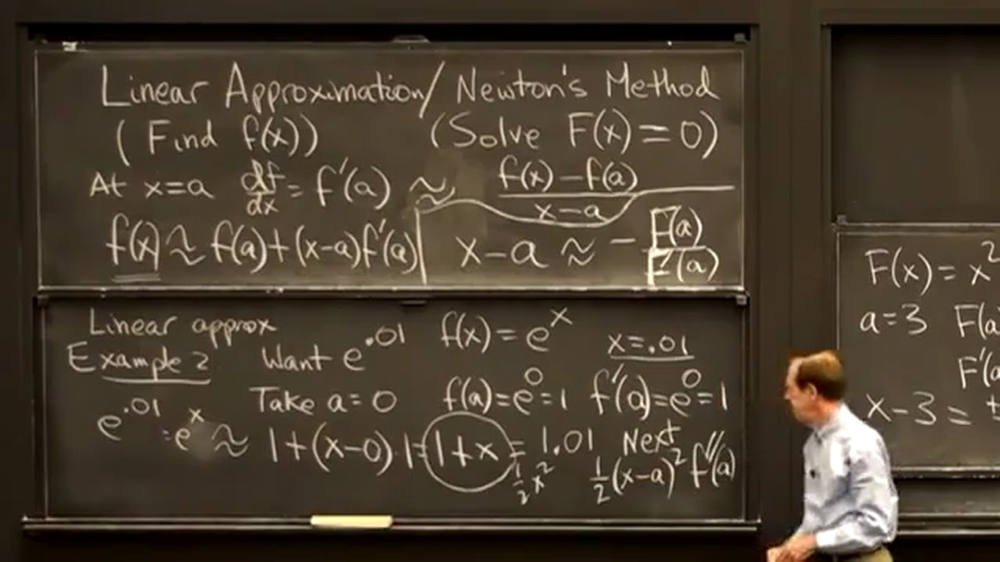

## 线性近似和牛顿法
线性近似是求 $f(x)$ 的值；牛顿法是求 $F(x)=0$ 的解。下面推导一下：  
在 $x=a$ 处，
$$
\frac{\operatorname d f}{\operatorname d x}=f'(a)\approx \frac{f(x) - f(a)}{x - a} \tag1
$$
这里 $x$ 不趋向于 $a$ ，是 $a$ 附近的一个点，所以不用等于而是约等于。  
由式(1)可以推导出**线性近似公式**：  
$$f(x)\approx f(a)+(x-a)f'(a)\tag2$$  
求解线性近似问题，需要在要求的 $x$ 附近，有一个点 $a$ 容易算得 $f(a)$ 并知道其导数 $f'(a)$ 。
由式(1)也可以推导出**牛顿法的公式**：  
求 $F(x)=0$ 的解，将式(2)中的 $f(x)$ 替换为 $F(x)$ 得：  
$$
0\approx f(a)+(x-a)f'(a) \\[2ex]
x\approx a-\frac{F(a)}{F'(a)} \\[2ex]
$$

  
例：求 $\sqrt{9.06}$ 的值。  
方法一（线性近似法）：
令 $f(x)=\sqrt{x}$ ， $f'(x)=\frac{1}{2}x^{-\frac{1}{2}}$ ，取 $a=9$ 得：  
$$
f(9.06)\approx f(9)+(9.06-9)f'(9)=3+0.06\times\frac{1}{6}=3.01
$$

  
方法二（牛顿法）：
构建函数 $F(x) = x^2-9.06$ ， $F'(x) = 2x$ ，令 $F(x) = 0$ ，求解 $F(x)$ ，令 $a=3$ 。  
$$
x\approx 3-\frac{F(3)}{F'(3)} \\[2ex]
x\approx 3-\frac{-0.06}{6} \\[2ex]
x\approx 3.01 \\[2ex]
$$
与方法一求得的结果相同。  

  
可以将上次求解的值再次带入计算，令 $a_{new}=3.01$ ，再次求解 $F(x)$ ：
$$
x_{new}\approx 3.01-\frac{F(3.01)}{F'(3.01)} \\[2ex]
x_{new}\approx 3.01-\frac{0.0001}{6.02} \\[2ex]
x_{new}\approx 3.00998338870 \\[2ex]
$$
$x=3.01$ 时， $error=x^2 - 9.06=3.01^2-9.06=0.0001$ ；  
$x=3.00998338870$ 时， $error=x^2 - 9.06=3.00998338870^2-9.06\approx0.00000000025$ 。  
可以发现，迭代后误差变小了很多，网上找到了一张图片，非常清晰明了：  

  
例：求 ${\rm e}^{0.01}$ 的值。  
令 $f(x)={\rm e}^x$ ， $f'(x)={\rm e}^x$ ，取 $a=0$ 得：  
$$
f(x)\approx f(0)+(x-0)f'(0)=1+x=1+0.01=1.01
$$
这里已经得出了答案，再观察下上面的式子 $f(x)={\rm e}^x\approx1+x$ 发现线性近似与幂级数类似，比如 ${\rm e}^x=1+x+x^2/2+\cdots$ ，相当于幂级数从常数项和线性项之后拦腰截断。  
