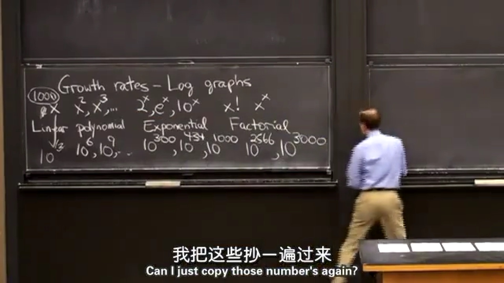
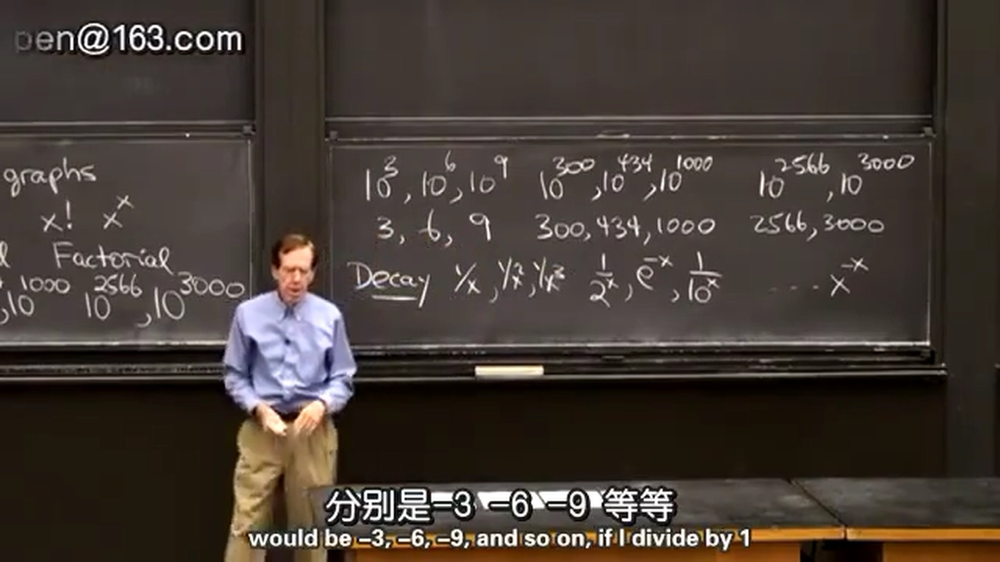
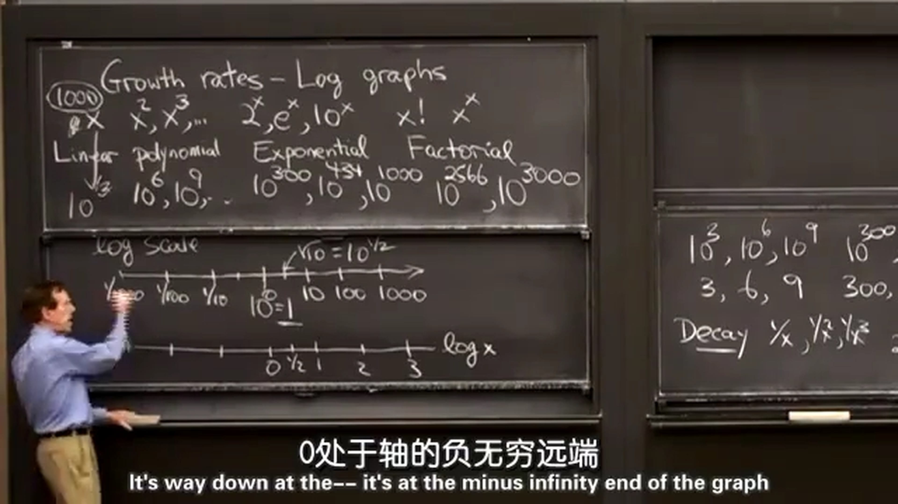
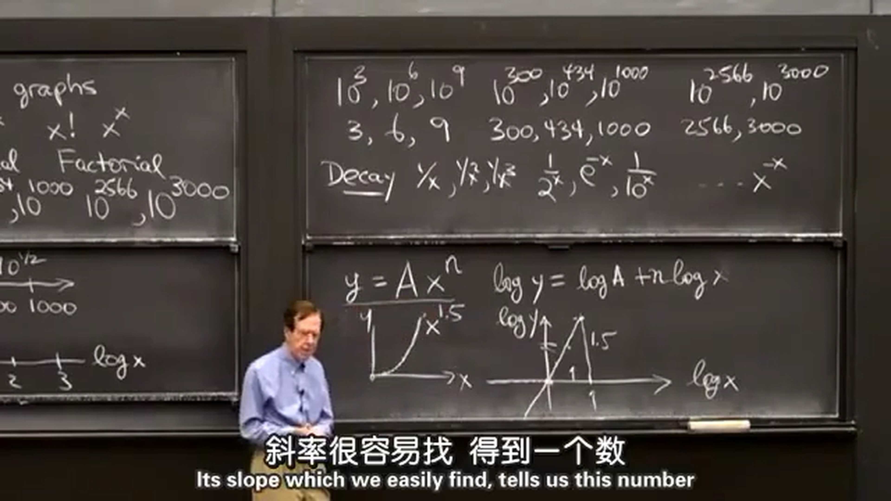
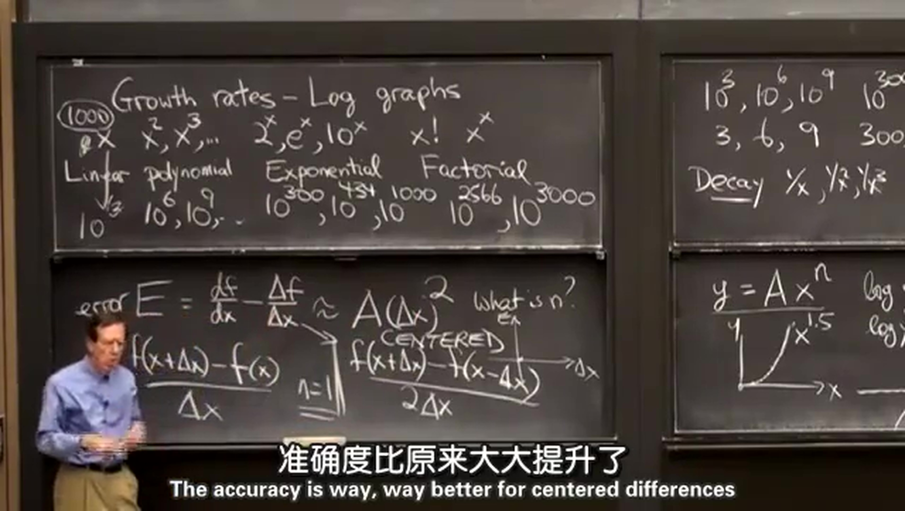

## 1.增长率
| 增长函数 | $x$ | $x^2$ ， $x^3$ ，… | $2^x$ ， $e^x$ ， $10^x$ ，…| $x!$ ， $x^x$ ，…|
|---------| ---- | ------------------ | -------------------------- | ----------------- |
| 增长方式 | 线性增长 |    多项式增长    |          指数增长          |     阶乘增长     |
| 增长数量级 | $10^3$ | $10^6$ ， $10^9$ ，… | $10^{300}$ ， $10^{434}$ ， $10^{1000}$ ，…| $10^{2566}$ ， $10^{3000}$ ，…|
| 取对数 | $3$ | $6$ ， $9$ ，… | $300$ ， $434$ ， $1000$ ，…| $2566$ ， $3000$ ，…|
上表中，将 $x=1000$ 带入式子后，得到了增长的数量级，表格中是教授估算的值，我用计算器算了一遍，发现跟表中的值略有差异，不过表示增长的数量级是没问题的。  
  
衰减函数就是增长函数的倒数
| 衰减函数 | $\frac{1}{x}$ | $\frac{1}{x^2}$ ， $\frac{1}{x^3}$ ，… | $\frac{1}{2^x}$ ， $\frac{1}{e^x}$ ， $\frac{1}{10^x}$ ，…| $\frac{1}{x!}$ ， $\frac{1}{x^x}$ ，…|
|---------| ---- | ------------------ | -------------------------- | ----------------- |
带入 $x=1000$ 再取对数后，分别是： $-3，-6，-9$ 等等。  

  
## 2.对数图
对数尺度下 $0$ 和 $10$ 的中点是 $10^{1/2}$ ；将 $2$ 的乘幂（ $0\quad1\quad2\quad4\quad8\quad16\quad\cdots$ ）排列，发现其是等距排列的（ $n\log 2$ ）; $0$ 在对数尺度上没有对应值，处于对数轴的无穷远端。

  
例：幂函数 $y=Ax^n$ ，两边同时求对数得到： $\log y = \log A + n\log x$ ，下面画出 $y=x^{1.5}$ 的图像以及对数图。  
画出图像后，发现原来的图拟合比较复杂；对数图是直线的，拟合比较容易，斜率也容易找。  

指数函数 $y=B10^{cx}$ ，两边同时求对数得到： $\log y = \log B + cx$ ，这里纵轴用对数尺度，横轴用普通尺度。  
  
例：比较瞬时斜率和平均斜率之差： $error E=\frac{\operatorname d f}{\operatorname d x}-\frac{\Delta f}{\Delta x}\approx A(\Delta x)^n$ ; $\frac{f(x+\Delta x)-f(x)}{\Delta x}$ 的误差为： $n=1$ ; $\frac{f(x+\Delta x)-f(x-\Delta x)}{2\Delta x}$ 的误差为： $n=2$ ，准确度比原来大大提升了。
