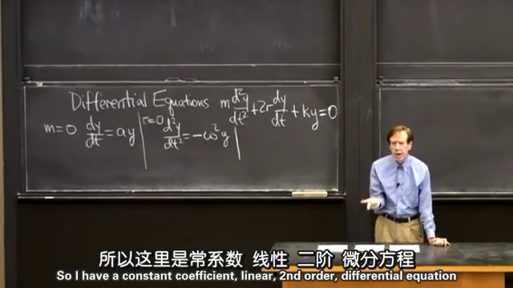
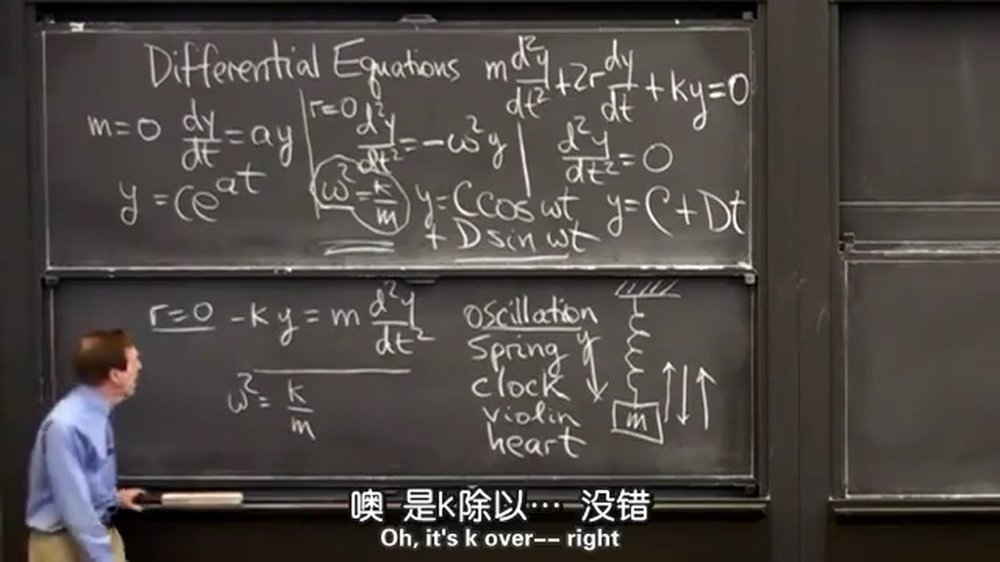
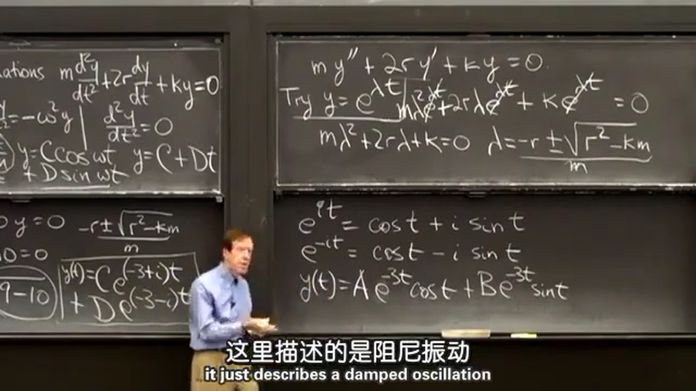

本节课讲的是常系数线性二阶微分方程。**常系数**是指函数 $y$ 及其 $n$ 阶导数前的系数都为常数；**线性**是指函数 $y$ 及其 $n$ 阶导数的幂都为 $1$ ；**微分方程**即以自变量 $x$ ，函数 $y$ 及其 $n$ 阶导数组成的方程。
$$
m\frac{\operatorname{d}^2y}{\operatorname{d}t^2} + 2r\frac{\operatorname{d}y}{\operatorname{d}t} + ky = 0
$$

### 1.特殊情况：  
当 $m=0$ 时:  
$$
\frac{\operatorname{d}y}{\operatorname{d}t} = ay
$$
$e^x$ 的导数等于其本身，所以该微分方程的解为：  
$$
y=C\rm{e}^{at}
$$
将解代入微分方程后发现，不管 $C$ 是多少，微分方程都成立， $C$ 由函数的初始条件决定。  
  
当 $r=0$ 时：  
$$
\frac{\operatorname{d}^2y}{\operatorname{d}t^2}= -\omega^2y\quad \omega^2=\frac{k}{m}
$$
$\sin x$ 和 $\cos x$ 的二次导数等于其本身的负，所以该微分方程的解为：  
$$
y=C\cos\omega t + D\sin\omega t
$$
  
当 $r=0，k=0$ 时：  
$$
\frac{\operatorname{d}^2y}{\operatorname{d}t^2}= 0
$$
这个微分方程的解比较容易得到：  
$$
y=C + Dt
$$
  
### 2.一般情况：  
再看这个关于运动的微分方程，该微分方程主要描述的是振动运动：  
$$
m\frac{\operatorname{d}^2y}{\operatorname{d}t^2} + 2r\frac{\operatorname{d}y}{\operatorname{d}t} + ky = 0
$$
如下图所示，根据牛顿定律 $F=ma$ 和弹力公式 $F=-k\Delta x$ 可以得到 $r=0$ 的特殊情况：  
$$
\frac{\operatorname{d}^2y}{\operatorname{d}t^2}= -\frac{k}{m}y
$$
更一般地，再加入阻尼力 $F=-cv$ ，就可以得到一般情况的振动运动微分方程。

  
下面来求解这个微分方程：  
代入 $y=\rm {e}^{\lambda t}$ 得到：  
$$
\begin{aligned}
m\frac{\operatorname{d}^2y}{\operatorname{d}t^2} + 2r\frac{\operatorname{d}y}{\operatorname{d}t} + ky = 0 \\[2ex]
m\lambda^2\rm {e}^{\lambda t} + 2r\lambda\rm {e}^{\lambda t} + k\rm {e}^{\lambda t} = 0 \\[2ex]
m\lambda^2\rm + 2r\lambda\rm + k\rm = 0 \\[2ex]
\lambda_{1,2} = \frac{-r\pm\sqrt{r^2-km}}{m} \\[2ex]
\end{aligned}
$$
将两个解代入后得到： $y = C\rm {e}^{\lambda_1 t} + D\rm {e}^{\lambda_2 t}$ 。
  
例1：求解 $y'' + 6y' + 8y = 0$ 。
得：
$$
\begin{aligned}
\lambda^2\rm + 6\lambda\rm + 8\rm = 0 \\
(\lambda + 2)(\lambda + 4)=0 \\
\lambda = -2, -4 \\
y(t) = C\rm {e}^{-2 t} + D\rm {e}^{-4 t}
\end{aligned}
$$
  
例2：求解 $y'' + 6y' + 10y = 0$ 。
得：
$$
\begin{aligned}
\lambda^2\rm + 6\lambda\rm + 10\rm = 0 \\[2ex]
\lambda = \frac{-6\pm\sqrt{36-40}}{2} \\[2ex]
\lambda = -3\pm i \\[2ex]
y(t) = C\rm {e}^{(-3 + i)t} + D\rm {e}^{(-3 - i)t} \\[2ex]
\end{aligned}
$$
代入欧拉公式，得：
$$
\begin{aligned}
y(t) = C\rm {e}^{-3t}\rm {e}^{it} + D\rm {e}^{-3t}\rm {e}^{-it} \\[2ex]
y(t) = C\rm {e}^{-3t}(\cos t + i\sin t) + D\rm {e}^{-3t}(\cos t - i\sin t) \\[2ex]
y(t) = (C + D)\rm {e}^{-3t}\cos t + (C - D)\rm {e}^{-3t}i\sin t \\[2ex]
\end{aligned}
$$
由于原方程的解符合叠加原理，所有取实部仍是该微分方程的解（不太理解，或者A、B都是复数）：  
$$
\begin{aligned}
y(t) = (C + D)\rm {e}^{-3t}\cos t + (C - D)\rm {e}^{-3t}\sin t \\[2ex]
y(t) = A\rm {e}^{-3t}\cos t + B\rm {e}^{-3t}\sin t \\[2ex]
\end{aligned}
$$

  
例3：求解 $y'' + 6y' + 9y = 0$ 。
得：
$$
\begin{aligned}
\lambda^2\rm + 6\lambda\rm + 9\rm = 0 \\
(\lambda + 3)^2=0 \\
\lambda = -3, -3 \\
y(t) = C\rm {e}^{-3 t} + Dt\rm {e}^{-3 t}
\end{aligned}
$$