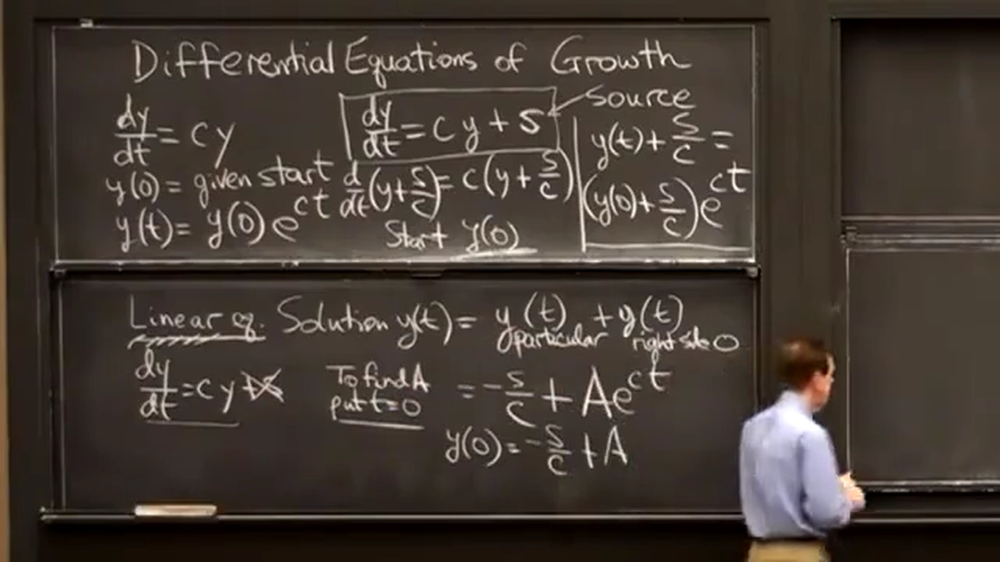
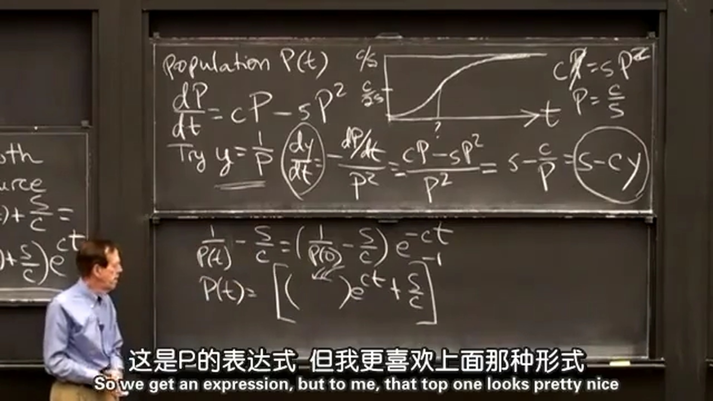
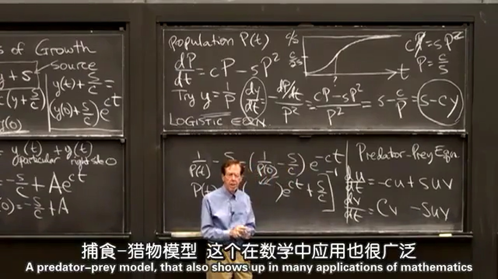

本节课讲的是关于增长的微分方程。  
### 1.最简单的增长微分方程
为：  
$$
\frac{\operatorname{d}y}{\operatorname{d}t} = cy\quad y(0)
$$
解为：  
$$
y(t) = y(0)\rm {e}^{ct}
$$
这里讲的比较抽象，可以用个例子帮助理解下。 $y(t)$ 表示储蓄账户里的钱， $c$ 为年利率， $y(0)$ 为第 $0$ 年存入的钱。如果年利率 $c=3\%$ ， $y(0)=10000$ ，那么解为： $y(t) = 10000\rm {e}^{0.03t}$ ，第 $1$ 年账户里的钱为 $y(1) = 10000\rm {e}^{0.03\times 1} = 10304.545$ ，第 $5$ 年账户里的钱为 $y(5) = 10000\rm {e}^{0.03\times 5} = 11618.342$ 。可能有人会奇怪，为什么第 $1$ 年账户里的钱不是 $10000\times (1+0.03) = 10300$ 。如果以月计算一次利息，月利率为 $0.03/12=0.0025$ ，第 $1$ 年账户里的钱变为 $10000\times (1+0.0025)^{12} = 10304.160$ 。如果计算利息的时间为无限短，那么利息总是有个极限，前面求的结果就是这个极限，也就是无限复利的结果（[第四课](../第四课%20指数函数/第四课%20指数函数（exponential）.md)的第4小节有部分说明）。  
  
### 2.将最简单的微分方程加上资源项
为：  
$$
\frac{\operatorname{d}y}{\operatorname{d}t} = cy+s\quad y(0)
$$
解为：  
$$
\frac{\operatorname{d}}{\operatorname{d}t}(y+\frac{s}{c}) = c(y+\frac{s}{c}) \\[2ex]
y(t) + \frac{s}{c} = (y(0) + \frac{s}{c})\rm {e}^{ct} \\[2ex]
$$
当 $s>0$ 时为存钱；当 $s<0$ 时为取钱。  
或者也可以通过特解加上通解的方式求得解，如下图所示：  

  
### 3.用于人口增长的LOGISTIC模型
为：  
$$
\frac{\operatorname{d}P}{\operatorname{d}t} = cP - sP^2
$$
$C$ 为人口增长率（出生率减去死亡率）； $sP^2$ 表示人口和人口之间的拥挤影响。  
令 $y=1/P$ ，解为：  
$$
\frac{\operatorname{d}y}{\operatorname{d}t}=\frac{\operatorname{d}y}{\operatorname{d}P}\frac{\operatorname{d}P}{\operatorname{d}t}=-P^2(cP-sP^2)=-(\frac{c}{p}-s)=-(cy-s) \\[2ex]
y(t) - \frac{s}{c} = (y(0) - \frac{s}{c})\rm {e}^{-ct} \\[2ex]
$$
代入 $y=1/P$ ：
$$
\begin{aligned}
\frac{1}{P(t)} - \frac{s}{c} = (\frac{1}{P(0)} - \frac{s}{c})\rm {e}^{-ct} \\[2ex]
\frac{1}{P(t)} = (\frac{1}{P(0)} - \frac{s}{c})\rm {e}^{-ct} + \frac{s}{c} \\[2ex]
P(t) = \left[(\frac{1}{P(0)} - \frac{s}{c})\rm {e}^{-ct} + \frac{s}{c}\right]^{-1} \\[2ex]
\end{aligned}
$$
当 $t\rightarrow \infty$ 时， $P\rightarrow c/s$ ，达到稳态； $c/(2s)$ 为拐点。图像如下面所示：  

  
### 4.捕食-猎物模型
为：  
$$
\frac{\operatorname{d}u}{\operatorname{d}t} = -cu + suv \\[2ex]
\frac{\operatorname{d}v}{\operatorname{d}t} = cv - suv \\[2ex]
$$
