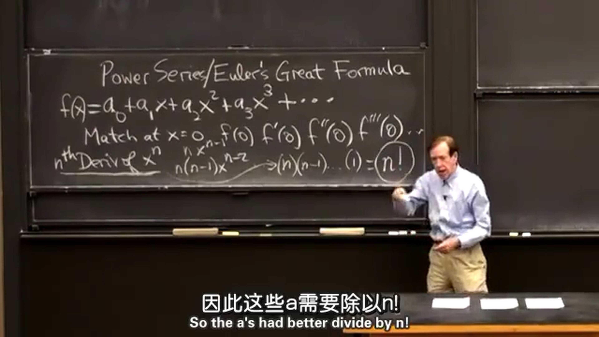
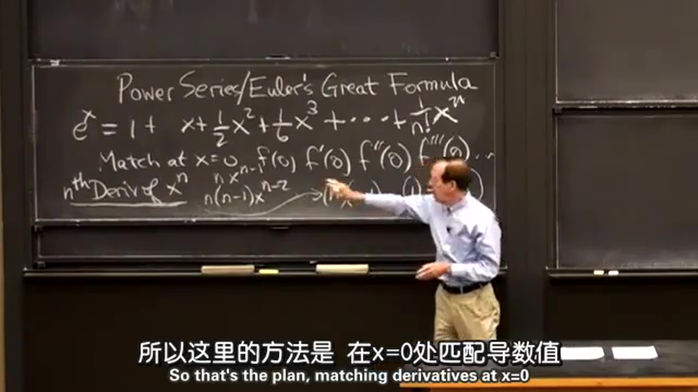
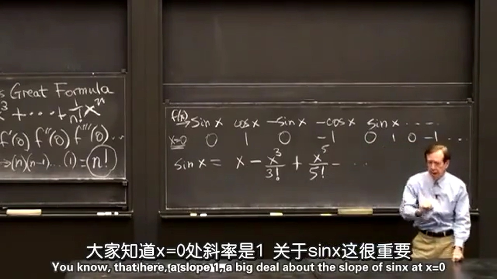
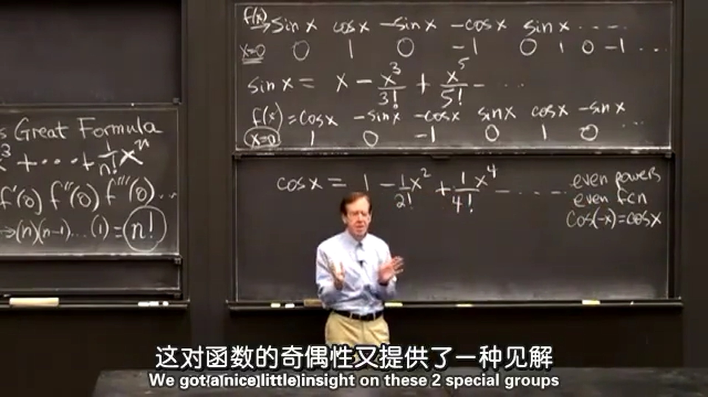
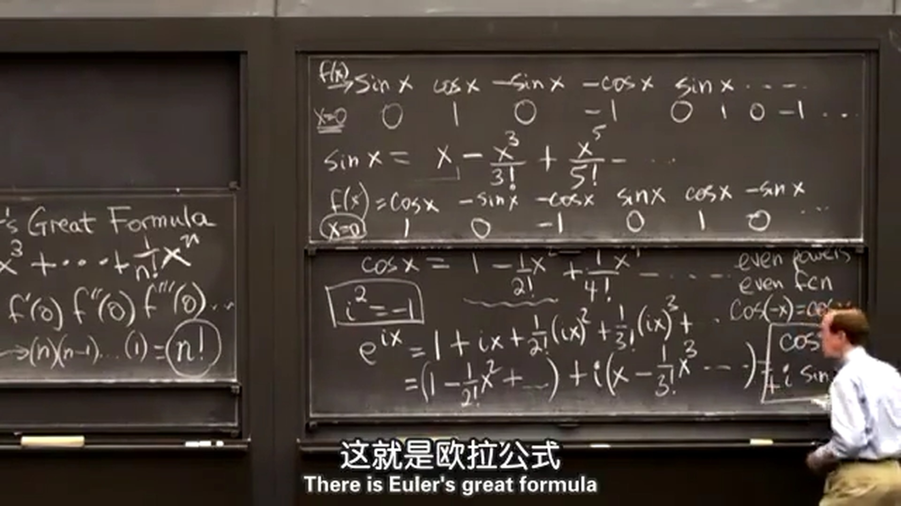
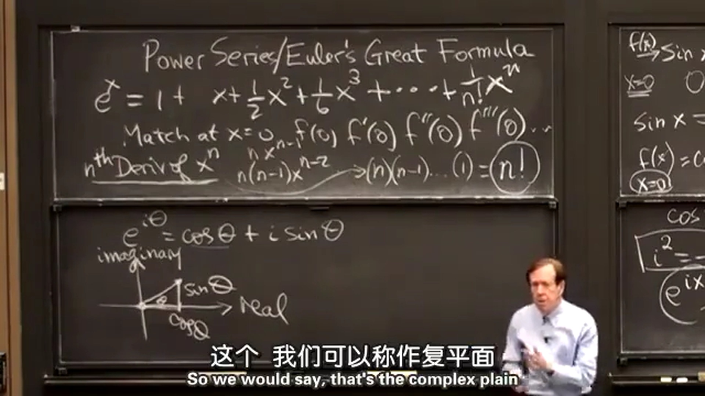
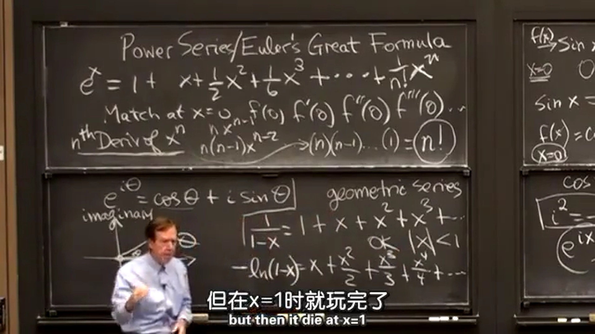

## 1.幂级数和泰勒级数
在 $x=a$ 时的一般幂级数为：
$$
\sum_{n=0}^{\infin} a_n(x-a)^n = a_0 + a_1(x-a) + a_2(x-a)^2 + a_3(x-a)^3 +\cdots
$$
下面将讨论关于 $x=0$ 的幂级数，为：  
$$
\sum_{n=0}^{\infin} a_nx^n = a_0 + a_1x + a_2x^2 + a_3x^3 +\cdots
$$
可以用幂级数构造 $f(x)$ ，需要找到一些 $a$ 来匹配在 $x=0$ 处的 $f(0)$ 、 $f'(0)$ 、 $f''(0)$ 、 $f'''(0)\cdots$ ，这就是泰勒级数。  
$f$ 关于 $x=0$ 的泰勒级数：  
$$
\sum_{n=0}^{\infin} \frac{f^{(n)}(0)}{n!}x^n = f(0) + f'(0)x + \frac{f''(0)}{2!}x^2 + \frac{f'''(0)}{3!}x^3 + \frac{f^{(4)}(0)}{4!}x^4 +\cdots
$$

  
例：使用泰勒级数展开 ${\rm e}^x$ 。  
$f(x)={\rm e}^x$ 所有的导数在 $x=0$ 处都为 $1$ ，所以：  
$$
f(x) = {\rm e}^x = 1 + x + \frac{1}{2!}x^2 + \frac{1}{3!}x^3 + \cdots + \frac{1}{n!}x^n
$$
这里总结下使用泰勒级数展开的系统性方法：求各阶导，代入 $0$ ，求各阶导在 $0$ 处的值后再代入泰勒级数。  

  
例：使用泰勒级数展开 $\sin x$ 。  
$$
f(x) = \sin x \quad f'(x) = \cos x \quad f''(x) = -sin(x) \quad f'''(x) = -\cos x \quad f^{(4)}(x) = \sin x \quad f^{(5)}(x) = \cos x \quad f^{(6)}(x) = -sin(x) \quad f^{(7)}(x) = -\cos x \quad\cdots发现4个一个循环 \\[2ex]
f(0) = 0 \qquad\ f'(0) = 1 \qquad\quad f''(0) = 0 \qquad\qquad f'''(0) = -1 \qquad\quad f^{(4)}(0) = 0 \qquad\ f^{(5)}(0) = 1 \qquad\quad f^{(6)}(0) = 0 \qquad\qquad f^{(7)}(0) = -1 \qquad\cdots \\[2ex]
f(x) = \sin x = x - \frac{1}{3!}x^3 + \frac{1}{5!}x^5 - \frac{1}{7!}x^7\cdots \\[2ex]
$$

  
例：使用泰勒级数展开 $\cos x$ 。  
$$
f(x) = \cos x \quad f'(x) = -sin(x) \quad f''(x) = -\cos x \quad f'''(x) = \sin x \quad f^{(4)}(x) = \cos x \quad f^{(5)}(x) = -sin(x) \quad f^{(6)}(x) = -\cos x \quad f^{(7)}(x) = \sin x \quad\cdots 通样4个一个循环 \\[2ex]
f(0) = 1 \qquad\ f'(0) = 0 \qquad\qquad f''(0) = -1 \qquad\quad f'''(0) = 0 \qquad\quad f^{(4)}(0) = 1 \qquad\ f^{(5)}(0) = 0 \qquad\qquad f^{(6)}(0) = -1 \qquad\quad f^{(7)}(0) = 0 \qquad\cdots \\[2ex]
f(x) = \cos x = 1 - \frac{1}{2!}x^2 + \frac{1}{4!}x^4 -\frac{1}{6!}x^6\cdots \\[2ex]
$$

观察 $\sin x$ 和 $\cos x$ 的泰勒级数展开可以发现， $\sin x$ 的泰勒级数展开中幂函数的指数都为奇数，所以为奇函数；$\cos x$ 的泰勒级数展开中幂函数的指数都为偶数，所以为偶函数。这里为函数的奇偶性提供了另一种见解。  
再将 $\sin x$ 的泰勒级数展开中 $x$ 后的部分截断，得到： $\sin x = x$ ，这就是 $\sin x$ 在 $x=0$ 处的线性近似。（这里可以再查看下[上一节课](../第十三课%20线性近似和牛顿法/第十三课%20线性近似和牛顿法.md)求 ${\rm e}^{0.01}$ 的例子，比 $\sin x$ 的例子更清楚。）  
观察泰勒级数，每一项的分子是幂函数，分母是阶乘，在[第十二课](../第十二课%20增长率和对数图/第十二课%20增长率和对数图.md)中学习到，阶乘增长是大于幂函数的多项式增长的，所以其高阶项的贡献比较小。在余弦级数中代入 $x=\pi$ ，它们会相互抵消，变得很小，最终得到答案 $-1$ 。
  
## 2.欧拉公式
这里需要使用虚数 $i$ ， $i^2=-1$ 。下面推导一下：  
$$
\begin{aligned}
e^{ix} &= 1 + ix - \frac{1}{2!}x^2 - \frac{1}{3!}ix^3 + \cdots \\[2ex]
&= (1 - \frac{1}{2!}x^2 + \cdots) +i(x - \frac{1}{3!}x^3 + \cdots) \\[2ex]
&=\cos x + i\sin x \\[2ex]
\end{aligned}
$$

将 $x$ 替换为 $\theta$ 得到：  
$$
e^{i\theta} = \cos\theta + i\sin\theta \\[2ex]
$$
接着可以画出复平面：  

  
## 3.几何级数及其积分
几何级数：  
$$
\frac{1}{1-x} = 1 + x + x^2 + x^3 + \cdots
$$
可以通过两边都乘以 $1-x$ 证明。 $|x| < 1$ 时成立。
将上述级数进行积分：  
$$
-\ln(1-x) = x + \frac{x^2}{2} + \frac{x^3}{3} + \frac{x^4}{4} + \cdots
$$
也是在 $|x| < 1$ 时成立。

  
*PS：这里感觉学得不是很透彻，后续再看书。*