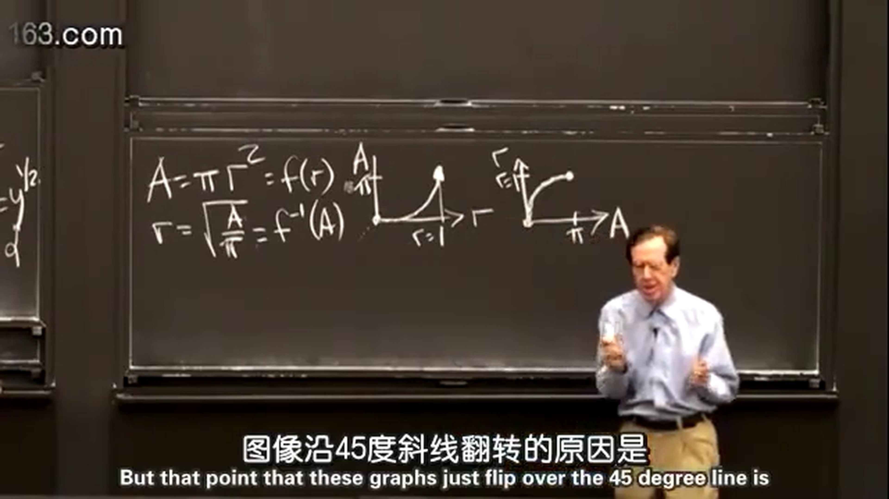
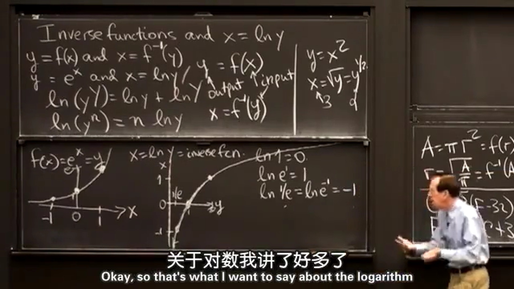
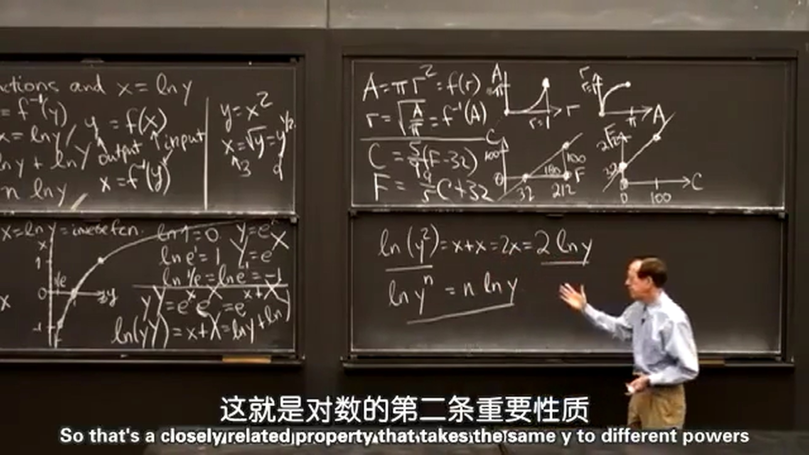
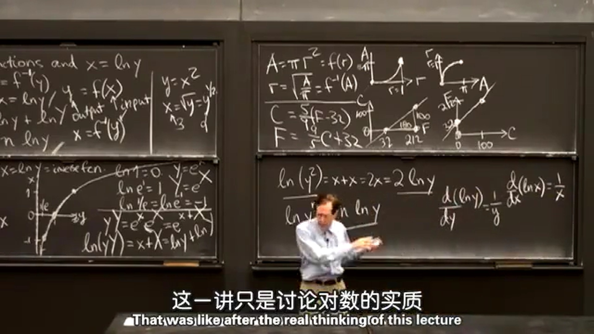

## 1.逆函数
$y=f(x)$ 的逆函数是： $x=f^{-1}(y)$ 。
例：求函数 $y=x^2（x\geq 0）$ 的逆函数。求得： $x=\sqrt{y}$ 。  
这里需要有条件 $x\geq 0$ ，求逆函数需要 $y$ 与 $x$ 的值一一对应。  

  
例：圆面积公式为： $A=\pi r^2=f(r)$ ，其逆函数为： $r=\sqrt{\frac{A}{\pi}}=f^{-1}(A)$ 。  
图像如下所示，图像沿45°斜线翻转的原因是 $x$ 和 $y$ 互换了。  

  
例：华氏度转换为摄氏度为： $C=\frac{5}{9}(F-32)$ ，其逆函数为摄氏度转华氏度： $F=\frac{9}{5}C+32$ 。  
图像如下所示，两个图像也是沿45°斜线翻转，且一个斜率是另一个斜率的倒数。

  
## 2.对数函数
这里教授说的指数函数指的是以自然常数 $\rm e$ 为底的指数函数；对数函数是以自然常数 $\rm e$ 为底的对数函数。画出指数函数和对数函数的图像：  

  
证明对数函数的性质一： $\ln(yy)=\ln y + \ln y$  
这里使用指数函数的性质证明：  
$$
y=e^x \\
yy=e^xe^x=e^{x+x} \\
\ln yy=x+x=\ln y+\ln y
$$
  
证明对数函数的性质二： $\ln(y^n)=n\ln y$  
这里教授证明的比较随意：  
$$
\ln y^2=x+x=2x=2\ln y \\
同理\ln y^n=n\ln y
$$

  
对数 $\ln x$ 的导数为（这里直接给出了结论）：
$$\frac{\operatorname{d}}{\operatorname{d}x}(\ln x)=\frac{1}{x}$$
