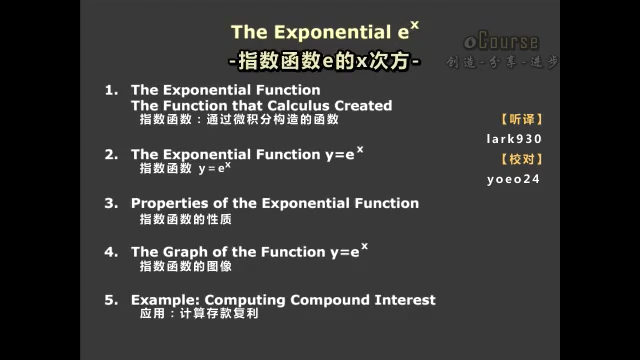
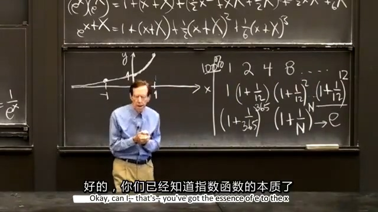
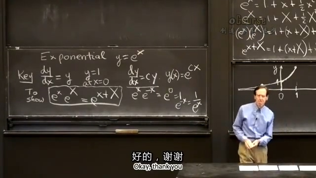

## 0.先上本节课目录：
  
讲的顺序不完全按照目录来的，下面就按照讲的顺序来。  
  
## 1.推导指数函数 $y=e^x$ 的展开式
对于指数函数 $y=e^x$ ，是通过微积分构造的函数，其最重要的性质就是它的导数就是其自身。用式子表示为：
$$\frac{\operatorname dy}{\operatorname dx}=y\tag1$$
这是一个微分方程，是最简单的微分方程。
此时还需要一个初值，以防得到的结果不是 $10e^x$ ，等等。
$$y(0)=1\tag2$$
准备完成，下面就开始构造函数：
由其在0处的初值为1（式 (2) ），先构造
$$y(x)=1$$
又由于它的导数就是其自身（式 (1) ）：
$$\frac{\operatorname dy}{\operatorname dx}=1$$
由此接着反推原函数：
$$y(x)=1+x$$
继续推到其导数：
$$\frac{\operatorname dy}{\operatorname dx}=1+x$$
原函数：
$$y(x)=1+x+\frac{1}{2}x^2$$
导数：
$$\frac{\operatorname dy}{\operatorname dx}=1+x+\frac{1}{2}x^2$$
原函数：
$$y(x)=1+x+\frac{1}{2}x^2+\frac{1}{2\cdot3}x^3$$
导数：
$$\frac{\operatorname dy}{\operatorname dx}=1+x+\frac{1}{2}x^2+\frac{1}{2\cdot3}x^3$$
这样写下去就没完没了了，它是无穷的，此时也发现了一些规律，可以推导出：
$$y(x)=1+x+\frac{1}{2}x^2+\frac{1}{2\cdot3}x^3+\cdots+\frac{x^n}{n!}+\cdots$$
$$\frac{\operatorname dy}{\operatorname dx}=1+x+\frac{1}{2}x^2+\frac{1}{2\cdot3}x^3+\cdots+\frac{x^{n-1}}{(n-1)!}+\frac{x^n}{n!}+\cdots$$
这里阶乘（ $n!$ ）的增长要大于幂函数（ $x^n$ ），越是后面的式子对函数的影响越小。
  
## 2.用展开式证明 $e^x\cdot e^x=e^{2x}$
大家都知道 $e^x\cdot e^x=e^{2x}$ ，下面将用展开式证明：
$$e^x=1+x+\frac{1}{2}x^2+\frac{1}{6}x^3+\cdots$$
$$e^x=1+x+\frac{1}{2}x^2+\frac{1}{6}x^3+\cdots$$
上面两式相乘，得到：
$$
\begin{aligned}
e^x\cdot e^x&=1+(x+x)+(\frac{1}{2}x^2+x^2+\frac{1}{2}x^2)+(\frac{1}{6}x^3+\frac{1}{2}x^3+\frac{1}{2}x^3+\frac{1}{6}x^3)+\cdots \\
&=1+2x+\frac{1}{2}(2x)^2+\frac{1}{6}(2x)^3+\cdots \\
&=e^{2x}
\end{aligned}
$$
  
## 3.求 $e$ 的值与该函数图像
上述展开式就是教授认为第二重要的指数级数，顺便介绍了下最重要的几何级数（上述展开式去掉分数部分）。
令 $x=1$ ，便可得到 $e$ ：
$$
\begin{aligned}
e&=1+1+\frac{1}{2}+\frac{1}{6}+\cdots \\[2ex]
&=2.71828\ldots
\end{aligned}
$$
顺便画了个图 $y(x)=e^x$ ：  
.jpg)

## 4.另一种求 $e$ 的方式
假如你每年可以从银行获取100%的利息，从1块钱开始，那么第一年年底可以获得2块钱。
如果银行每个月结一次利息，那么第一个月底可以获得：
$$
\left (1+\frac{1}{12} \right )
$$
年底可以获得：
$$
\left (1+\frac{1}{12} \right )^{12}=2.61303529\ldots
$$
每天结算一次，年底可以获得：
$$
\left (1+\frac{1}{365} \right )^{365}=2.71456748\ldots
$$
是不是获得钱越来越像 $e$ 了，没错
$$
\lim_{N \to \infty}{\left (1+\frac{1}{N} \right )^{N}}=e
$$

  
## 5.帯系数的一阶微分方程
$$
\frac{\operatorname dy}{\operatorname dx}=cy
$$
解为：
$$
y(x)=e^{cx}
$$
