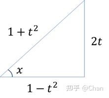

1. 正弦和差公式、余弦和差公式
$\sin(\alpha \pm \beta)=\sin\alpha\cos\beta \pm \cos\alpha\sin\beta$
$\cos(\alpha \pm \beta)=\cos\alpha\cos\beta \mp \sin\alpha\sin\beta$
  
2. 积化和差
$
{\displaystyle \sin \alpha \cos \beta ={\sin(\alpha +\beta )+\sin(\alpha -\beta ) \over 2}}  \\[2ex]
{\displaystyle \cos \alpha \sin \beta ={\sin(\alpha +\beta )-\sin(\alpha -\beta ) \over 2}}  \\[2ex]
{\displaystyle \cos \alpha \cos \beta ={\cos(\alpha +\beta )+\cos(\alpha -\beta ) \over 2}} \\[2ex]
{\displaystyle \sin \alpha \sin \beta =-{\cos(\alpha +\beta )-\cos(\alpha -\beta ) \over 2}}  \\[2ex]
$
  
3. 和差化积
$
{\displaystyle \sin \alpha +\sin \beta =2\sin {\frac {\alpha +\beta }{2}}\cos {\frac {\alpha -\beta }{2}}}  \\[2ex]
{\displaystyle \sin \alpha -\sin \beta =2\cos {\alpha +\beta  \over 2}\sin {\alpha -\beta  \over 2}} \\[2ex]
{\displaystyle \cos \alpha +\cos \beta =2\cos {\frac {\alpha +\beta }{2}}\cos {\frac {\alpha -\beta }{2}}} \\[2ex]
{\displaystyle \cos \alpha -\cos \beta =-2\sin {\alpha +\beta  \over 2}\sin {\alpha -\beta  \over 2}} \\[2ex]
$

4. 万能公式
$
\displaystyle 令t=\tan(\frac{x}{2})，   \\[2ex]
\displaystyle 则\tan x=\frac{2t}{1-t^2}       \\[2ex]
根据三角函数的几何意义绘出三边关系图：
$

$
则  \\
\displaystyle \sin x=\frac{2t}{1+t^2}       \\[2ex]
\displaystyle \cos x=\frac{1-t^2}{1+t^2}  \\[2ex]
$

垂直斜率相乘等于-1
诱导公式
sin(x+90) = cosx

arcsinx + arccosx =pi/2

微分近似公式

泰勒公式